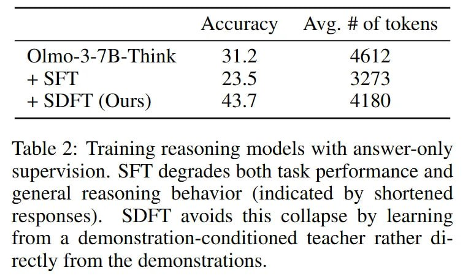

# Image Description

**File:** img_1770036072_aqadngtrg07jauh9_accuracy_avg_of_tokens.jpg
**Original:** image.jpg
**Received:** 1770036072

## Extracted Text (OCR)

| Accuracy Avg. # of tokens   |
|-----------------------------|
| + SFI                       |
| + SDFT (Ours) 43.7 4180     |

Table 2: Training reasoning models with answer-only supervision. SFT degrades both task performance and general reasoning behavior (indicated by shortened responses). SDEFT avoids this collapse by learning from a demonstration-conditioned teacher rather а1rectly from the demonstrations.

## Usage Instructions

When referencing this image in markdown:
1. Use relative path based on file location
2. Add descriptive alt text based on OCR content above
3. Add text description BELOW the image for GitHub rendering

Example:
```markdown
 <!-- TODO: Broken image path -->

**Image shows:** [Describe what the image contains based on OCR]
```
