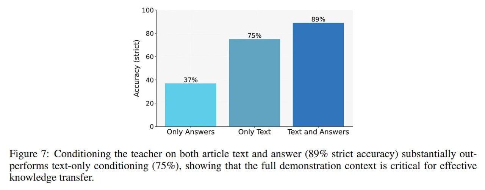

# Image Description

**File:** img_1770036072_aqadnwtrg07jauh_figure_7_conditioning_the_teacher_on.jpg
**Original:** image.jpg
**Received:** 1770036072

## Extracted Text (OCR)

Figure 7: Conditioning the teacher on both article text and answer (89% strict accuracy) substantially outperforms text-only conditioning (75%), showing that the full demonstration context 1$ critical for effective knowledge transfer.

<!-- image -->

## Usage Instructions

When referencing this image in markdown:
1. Use relative path based on file location
2. Add descriptive alt text based on OCR content above
3. Add text description BELOW the image for GitHub rendering

Example:
```markdown
 <!-- TODO: Broken image path -->

**Image shows:** [Describe what the image contains based on OCR]
```
