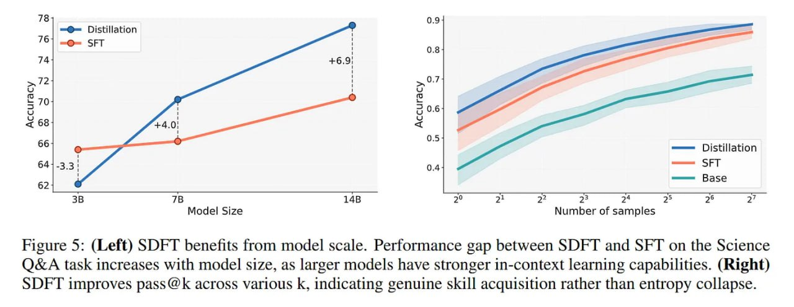

# Image Description

**File:** img_1770036072_aqadoatrg07jauh_figure_5_left_sdft_benefits_from.jpg
**Original:** image.jpg
**Received:** 1770036072

## Extracted Text (OCR)

Figure 5: (Left) SDFT benefits from model scale. Performance gap between SDFT and SFT on the Science Q&amp;A task increases with model size, as larger models have stronger in-context learning capabilities. (Right) SDF I improves pass @ к across various к, indicating genuine skill acquisition rather than entropy collapse.

<!-- image -->

## Usage Instructions

When referencing this image in markdown:
1. Use relative path based on file location
2. Add descriptive alt text based on OCR content above
3. Add text description BELOW the image for GitHub rendering

Example:
```markdown
 <!-- TODO: Broken image path -->

**Image shows:** [Describe what the image contains based on OCR]
```
