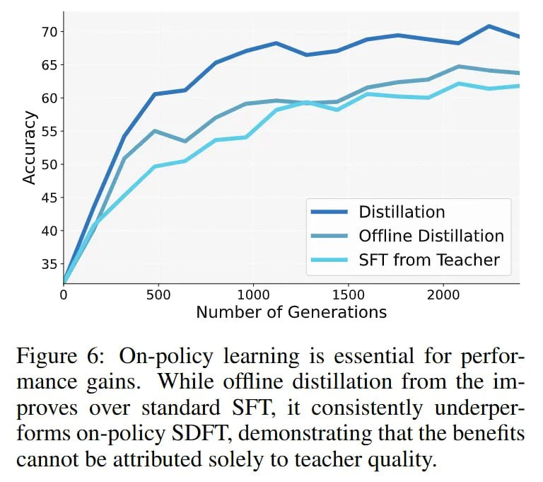

# Image Description

**File:** img_1770036072_aqadoqtrg07jauh9_figure_6_learning_is_essential.jpg
**Original:** image.jpg
**Received:** 1770036072

## Extracted Text (OCR)

Figure 6: Оп-ройсу learning is essential for performance gains. While offline distillation from the 1тproves over standard SFT, it consistently underperforms on-policy SDFT, demonstrating that the benefits cannot be attributed solely to teacher quality.

<!-- image -->

## Usage Instructions

When referencing this image in markdown:
1. Use relative path based on file location
2. Add descriptive alt text based on OCR content above
3. Add text description BELOW the image for GitHub rendering

Example:
```markdown
 <!-- TODO: Broken image path -->

**Image shows:** [Describe what the image contains based on OCR]
```
