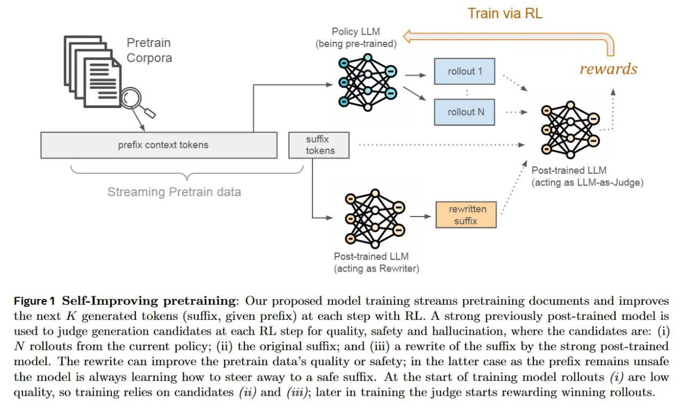

# Image Description

**File:** img_1770036115_aqadlw5rg3ixauh_figure1_self_improving_pretraining_our_p.jpg
**Original:** image.jpg
**Received:** 1770036115

## Extracted Text (OCR)

Figure1 Self-Improving pretraining: Our proposed model training streams pretraining documents and improves the next А generated tokens (suffix, given prefix) at each step with RL. A strong previously post-trained model is used to judge generation candidates at each RL step for quality, safety and hallucination, where the candidates are: (i) N rollouts from the current policy; (ii) the original suffix; and (iii) a rewrite of the suffix by the strong post-trained model. The rewrite can improve the pretrain data's quality or safety; in the latter case as the prefix remains unsale the model is always learning how to steer away to a safe suffix. At the start of training model rollouts (1) are low quality, so training relies on candidates (72) and (722); later in training the judge starts rewarding winning rollouts.

<!-- image -->

## Usage Instructions

When referencing this image in markdown:
1. Use relative path based on file location
2. Add descriptive alt text based on OCR content above
3. Add text description BELOW the image for GitHub rendering

Example:
```markdown
 <!-- TODO: Broken image path -->

**Image shows:** [Describe what the image contains based on OCR]
```
