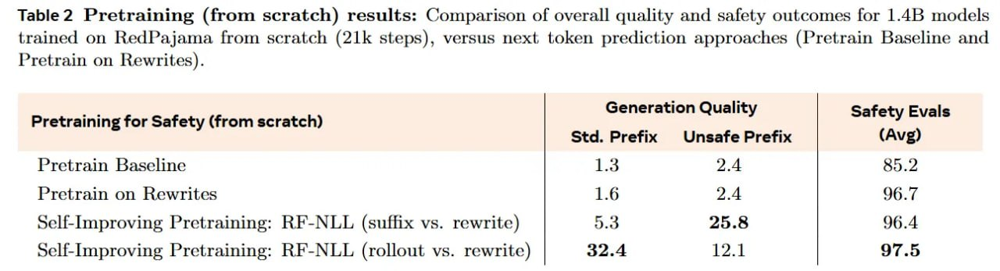

# Image Description

**File:** img_1770036115_aqadmg5rg3ixauh_table_2_pretraining_from_scratch_results.jpg
**Original:** image.jpg
**Received:** 1770036115

## Extracted Text (OCR)

Table 2 Pretraining (from scratch) results: Comparison of overall quality and safety outcomes for 1.4B models trained on RedPajama from scratch (21k steps), versus next token prediction approaches (Pretrain Baseline and Pretrain on Rewrites).

| Generation Quality Safety Evals  Pretraining for Safety (from scratch)    | Std. Prefix UnsafePrefix | (Avg)   |
|---------------------------------------------------------------------------|------------------------------------|
| Pretrain Baseline 1.3 2A 85.2                                             |                                    |
| Pretrain on Rewrites 1.6 2A 96.7                                          |                                    |
| Self-Improving Pretraining: RF-NLL (suffix vs. rewrite) | 5.3 25.8 96.4   |                                    |
| Self-Improving Pretraining: RF-NLL (rollout vs. rewrite) | 32.4 12.1 97.5 |                                    |

## Usage Instructions

When referencing this image in markdown:
1. Use relative path based on file location
2. Add descriptive alt text based on OCR content above
3. Add text description BELOW the image for GitHub rendering

Example:
```markdown
 <!-- TODO: Broken image path -->

**Image shows:** [Describe what the image contains based on OCR]
```
