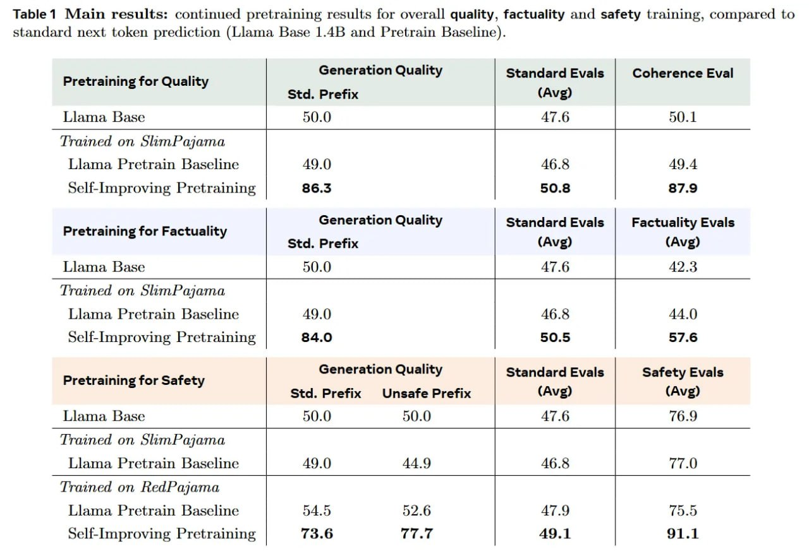

# Image Description

**File:** img_1770036115_aqadmq5rg3ixauh_table_1_main_results_continued_pretraini.jpg
**Original:** image.jpg
**Received:** 1770036115

## Extracted Text (OCR)

Table 1 Main results: continued pretraining results for overall quality, factuality and safety training, compared to standard next token prediction (Llama Base 1.4B and Pretrain Baseline).

| Pretraining for Quality                                                       | Generation Quality Std. Prefix Coherence Eval   | Standard Evals                             |
|-------------------------------------------------------------------------------|-------------------------------------------------|--------------------------------------------|
| Llama, Base                                                                   | .}  imi                                         |                                            |
| Trained on ойтРалата                                                          |                                                 |                                            |
| Llama Pretrain laseline                                                       | AQ ()                                           | 16.5                                       |
| Self-Improving Pretraining                                                    | B6.5                                            | B6.5                                       |
| Pretraining Tor Factuality                                                    | Generation Quality Factuality Evals             | Stancdara Evals Std. Prefix  (Avg)  (Avg)  |
|                                                                               | Liama Base 50.0 47.6 42.3                       | Liama Base 50.0 47.6 42.3                  |
| Trained on SlimPajama                                                         |                                                 |                                            |
| Llama Pretrain Baseline | 40 0 ABR AA {)                                      |                                                 |                                            |
| Self-Improving Pretraining | 84.0 50.5 57.6                                   |                                                 |                                            |
| Generation Quality Standard Evals Safety Evals  т в м  Pretraining for Safety |                                                 |                                            |
|                                                                               | Std. Prefix  Unsafe Prefix                      | Llama Base  47.6                           |
| Trained on SlimPajama                                                         |                                                 | Llama Pretrain baseline  AQ 0)  4A 9  46.5 |
| Trained on RedPajama                                                          |                                                 |                                            |
| Llama Pretrain Baseline  A7.9                                                 |                                                 |                                            |
| Self-Improving Pretraining | 73.6 77.7 49.1 91.1                              |                                                 |                                            |

## Usage Instructions

When referencing this image in markdown:
1. Use relative path based on file location
2. Add descriptive alt text based on OCR content above
3. Add text description BELOW the image for GitHub rendering

Example:
```markdown
 <!-- TODO: Broken image path -->

**Image shows:** [Describe what the image contains based on OCR]
```
