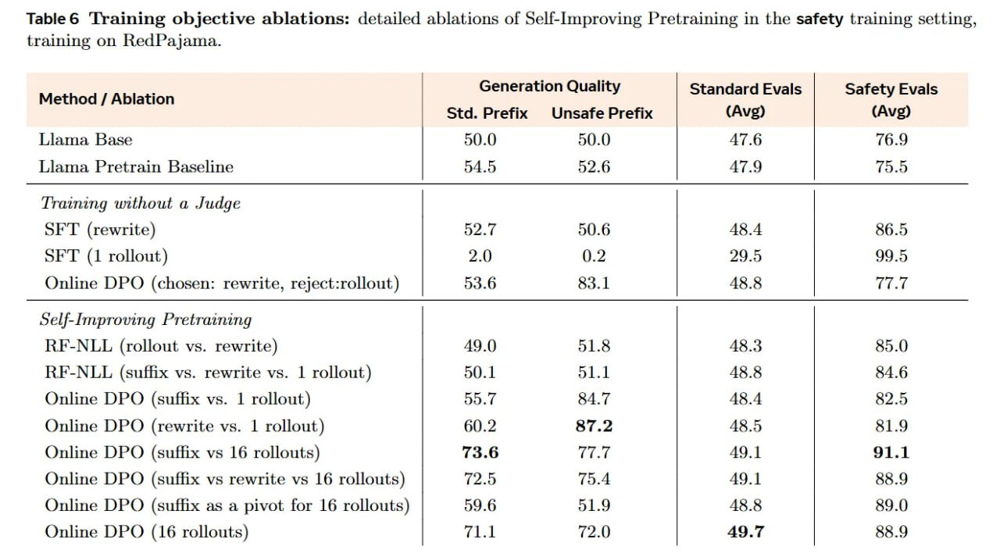

# Image Description

**File:** img_1770036115_aqadmw5rg3ixauh_table_6_training_objective_ablations_det.jpg
**Original:** image.jpg
**Received:** 1770036115

## Extracted Text (OCR)

Table 6 Training objective ablations: detailed ablations of Self-lmproving Pretraining in the safety training setting, training on RedPajama.

|                                                                          | Generation Qualit | Method / Ablation y Standard Evals Safety Evals Std. Prefix Unsafe Prefix | (Avg) (Avg)   |
|--------------------------------------------------------------------------|---------------------------------------------------------------------------------------------------------------|
| Liama Base                                                               |                                                                                                               |
| lLJama Pretrain Baseline                                                 |                                                                                                               |
| Trainng without a Judge                                                  |                                                                                                               |
| SET (rewrite) | 52.7 50.6 | 48.4 | 86.5                                  |                                                                                                               |
| SFT (1 rollout) | 2.0 0.2 | 29.5 | 99.5                                  |                                                                                                               |
| Online DPO (chosen: rewrite, reject:rollout) | 53.6 83.1 | 48.8 | ТТ.    |                                                                                                               |
| Sel/-improving Pretraining                                               |                                                                                                               |
| RE-NLL (rollout vs. rewrite) | 49.0 51.8 | 48.3 | 85.0                   |                                                                                                               |
| RF-NLL (suffix vs. rewrite vs. 1 rollout) | 50.1 51.1 48.8 84.6          |                                                                                                               |
| Online DPO (suffix vs. 1 rollout) | 55.7 84.7 | 48.4 | 82.5              |                                                                                                               |
| Online DPO (rewrite vs. 1 rollout) | 60.2 87.2 | 48.5 | 81.9             |                                                                                                               |
| Online DPO (suffix vs 16 rollouts) | 73.6 77.7 | 49.1 | 91.1             |                                                                                                               |
| Online DPO (suffix vs rewrite vs 16 rollouts) | 72.5 75.4 | 49.1 | 88.9  |                                                                                                               |
| Online DPO (suffix as a pivot for 16 rollouts) | 59.6 51.9 | 48.8 | 89.0 |                                                                                                               |
| Online DPO (16 rollouts) | 71.1 72.0 | 49.7 | 88.9                       |                                                                                                               |

## Usage Instructions

When referencing this image in markdown:
1. Use relative path based on file location
2. Add descriptive alt text based on OCR content above
3. Add text description BELOW the image for GitHub rendering

Example:
```markdown
 <!-- TODO: Broken image path -->

**Image shows:** [Describe what the image contains based on OCR]
```
