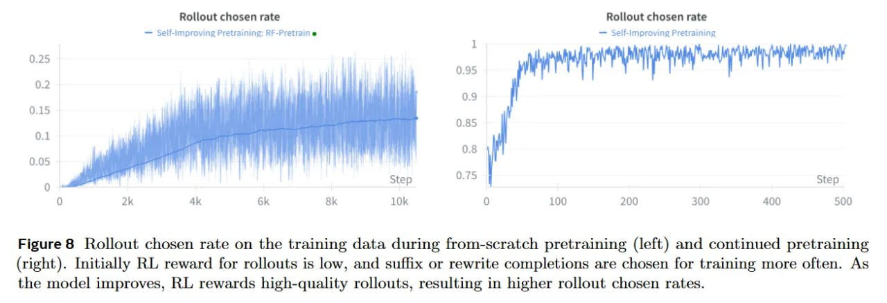

# Image Description

**File:** img_1770036115_aqadna5rg3ixauh_figure_8_rollout_chosen_rate_on.jpg
**Original:** image.jpg
**Received:** 1770036115

## Extracted Text (OCR)

Figure 8 Rollout chosen rate on the training data during from-scratch pretraining (left) and continued pretraining (right). Initially RL reward for rollouts is low, and suffix or rewrite completions are chosen for training more often. As the model improves, RL rewards high-quality rollouts, resulting in higher rollout chosen rates.

<!-- image -->

## Usage Instructions

When referencing this image in markdown:
1. Use relative path based on file location
2. Add descriptive alt text based on OCR content above
3. Add text description BELOW the image for GitHub rendering

Example:
```markdown
 <!-- TODO: Broken image path -->

**Image shows:** [Describe what the image contains based on OCR]
```
