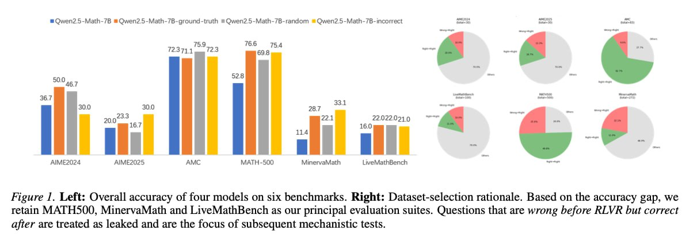

# Image Description

**File:** img_1770036219_aqadrw9rg0kceh_figure_left_overall_accuracy_of.jpg
**Original:** image.jpg
**Received:** 1770036219

## Extracted Text (OCR)

Figure Г. Left: Overall accuracy of four models on six benchmarks. Right: Dataset-selection rationale. Based on the accuracy gap, we retain MATHS00, MinervaMath and LiveMathBench as our principal evaluation suites. Questions that are wrong before RLVR but correct after are treated as leaked and are the focus of subsequent mechanistic tests.

<!-- image -->

## Usage Instructions

When referencing this image in markdown:
1. Use relative path based on file location
2. Add descriptive alt text based on OCR content above
3. Add text description BELOW the image for GitHub rendering

Example:
```markdown
 <!-- TODO: Broken image path -->

**Image shows:** [Describe what the image contains based on OCR]
```
