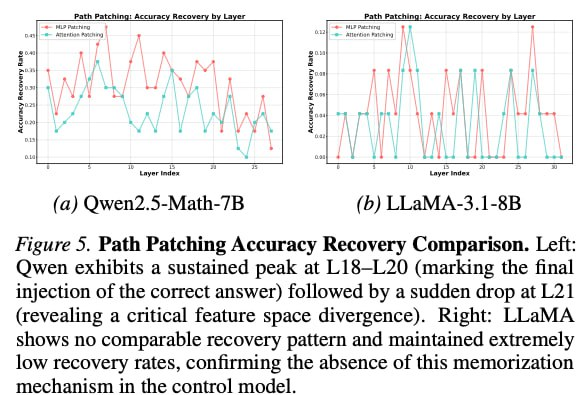

# Image Description

**File:** img_1770036219_aqadsg9rg0kceh9_image_figure_5_path.jpg
**Original:** image.jpg
**Received:** 1770036219

## Extracted Text (OCR)

<!-- image -->

Figure 5. Path Patching Accuracy Kecovery Comparison. Leit: Owen exhibits a sustained peak at L18—L20 (marking the final injection of the correct answer) followed by a sudden drop at L21 (revealing a critical feature space divergence). Right: LLaMA shows no comparable recovery pattern and maintained extremely low recovery rates, confirming the absence of this memorization mechanism in the control model.

## Usage Instructions

When referencing this image in markdown:
1. Use relative path based on file location
2. Add descriptive alt text based on OCR content above
3. Add text description BELOW the image for GitHub rendering

Example:
```markdown
 <!-- TODO: Broken image path -->

**Image shows:** [Describe what the image contains based on OCR]
```
