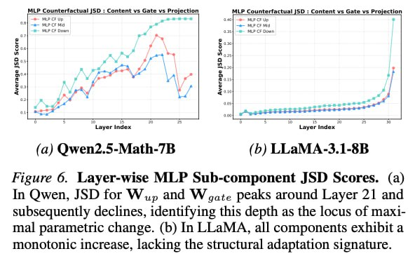

# Image Description

**File:** img_1770036219_aqadsw9rg0kceh9_image_figure_6_layer_wise.jpg
**Original:** image.jpg
**Received:** 1770036219

## Extracted Text (OCR)

<!-- image -->

Figure 6. Layer-wise MLP Sub-component JSD Scores. (a) In Qwen, JSD for М „р and W gate peaks around Layer 21 and subsequently declines, identifying this depth as the locus of maximal parametric change. (b) In LLaMA, all components exhibit a monotonic increase, lacking the structural adaptation signature.

## Usage Instructions

When referencing this image in markdown:
1. Use relative path based on file location
2. Add descriptive alt text based on OCR content above
3. Add text description BELOW the image for GitHub rendering

Example:
```markdown
 <!-- TODO: Broken image path -->

**Image shows:** [Describe what the image contains based on OCR]
```
