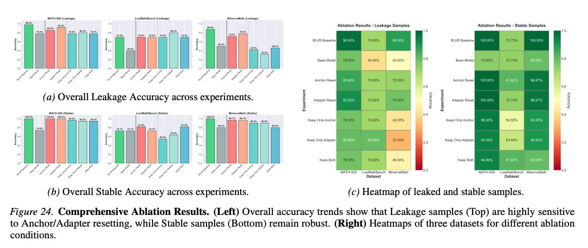

# Image Description

**File:** img_1770036219_aqaduq9rg0kceh_image_figure_24_comprehensive.jpg
**Original:** image.jpg
**Received:** 1770036219

## Extracted Text (OCR)

<!-- image -->

Figure 24. Comprehensive Ablation Results. (Left) Overall accuracy trends show that Leakage samples (Тор) are highly sensitive to Anchor/Adapter resetting, while Stable samples (Bottom) remain robust. (Right) Heatmaps of three datasets for different ablation conditions.

## Usage Instructions

When referencing this image in markdown:
1. Use relative path based on file location
2. Add descriptive alt text based on OCR content above
3. Add text description BELOW the image for GitHub rendering

Example:
```markdown
 <!-- TODO: Broken image path -->

**Image shows:** [Describe what the image contains based on OCR]
```
