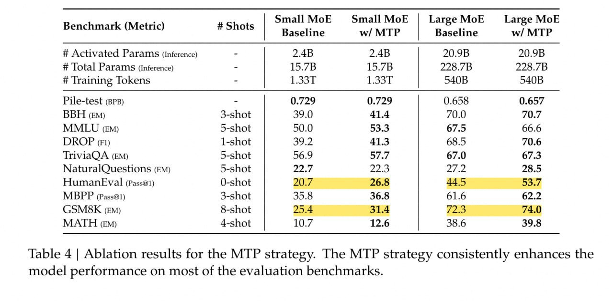

# Image Description

**File:** img_1770108589_aqadibbrgzgu8ut_table_4_ablation_results_for.jpg
**Original:** image.jpg
**Received:** 1770108589

## Extracted Text (OCR)

Table 4 | Ablation results for the MTP strategy. The MTP strategy consistently enhances the model performance on most of the evaluation benchmarks.

| Benchmark (Metric)             | # Shots   | Small МоЕ Small MoF Baseline  w/ MTP   | Large MoE Large Mok Baseline  w/ MTP   |
|--------------------------------|-----------|----------------------------------------|----------------------------------------|
| # Activated Params (Inference) |           |                                        |                                        |
| # Гоа! Params (Inference)      |           |                                        |                                        |
| # [raining lokens              |           |                                        |                                        |
| Pile-test (BPB)                |           |                                        | 0). 658 0.657                          |
| BBH (EM)                       | 3-shot    | 41.4                                   | 7().7                                  |
| MMLU (em)                      | 5-shot    |                                        |                                        |
| DROP (FL                       |           | 41.3                                   | 7().6                                  |
| TriviaQA (EM)                  | 5-shot    | 6.9  уг                                | 67.3                                   |
| NaturalQuestions (EM)          |           |                                        |                                        |
| HumanEkEval (Pass@1)           | O-shot    | 20.7 26.8                              | 53.7                                   |
| МБРР (Pass@1)                  | 3-shot    | 35.5 36.8                              |                                        |
| (GSMBK (Em)                    |           |                                        | 72.3 74.0                              |
| МАТН (em)                      | 4-shot    | 10./ 19.6                              | 39 8                                   |

## Usage Instructions

When referencing this image in markdown:
1. Use relative path based on file location
2. Add descriptive alt text based on OCR content above
3. Add text description BELOW the image for GitHub rendering

Example:
```markdown
 <!-- TODO: Broken image path -->

**Image shows:** [Describe what the image contains based on OCR]
```
