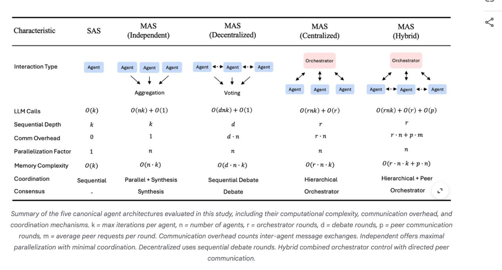

# Image Description

**File:** img_1770180601_aqadjg9rg9l2ut_image_nlas.jpg
**Original:** image.jpg
**Received:** 1770180601

## Extracted Text (OCR)

<!-- image -->

|                                                               | NLAS MAS  Characteristic SAS (Independent) (Decentralized) (Centralized) (Hybrid)                    |
|---------------------------------------------------------------|------------------------------------------------------------------------------------------------------|
|                                                               | interaction Type Agent Agent Agent Agent Agent <-* Agent <-* Agent Aggregation  Voting  Agent  Agent |
|                                                               | LLM Calls O(k) O(nk) + O(1) O(dnk) + O(1) O(rnk) + O(r) O(rnk) + O(r) + O(p)                         |
| Sequential Depth                                              |                                                                                                      |
| Comm Overhead 0 1 d-n г.п г. птр.т                            |                                                                                                      |
| Parallelization Factor                                        |                                                                                                      |
| Memory Complexity O(k) O(n-k) O(d-n-k) O(r-n-k) O(r-n-k+p-n)  |                                                                                                      |
|                                                               | Coordination Sequential Parallel + Synthesis Sequential Debate Hierarchical Hierarchical + Peer      |
| Consensus  Synthesis  Debate  Orchestrator  Orchestrator  = ь |                                                                                                      |

Summary of the five canonical agent architectures evaluated in this stuay, inciuding their computational compiexity, communication overhead, ana coordination mechanisms. К = max iterations per agent, п = number of agents, г = orchestrator rounds, а = debate rounds, р = peer communication rounds, m = average peer requests per round. Communication overhead counts inter-agent message exchanges. [Independent orfers maximal! parallelization with minimal coordination. Decentralized uses sequential дебае rounds. Hybrid combined orchestrator contro/ with directed peer communication.

"Аи ee

## Usage Instructions

When referencing this image in markdown:
1. Use relative path based on file location
2. Add descriptive alt text based on OCR content above
3. Add text description BELOW the image for GitHub rendering

Example:
```markdown
 <!-- TODO: Broken image path -->

**Image shows:** [Describe what the image contains based on OCR]
```
