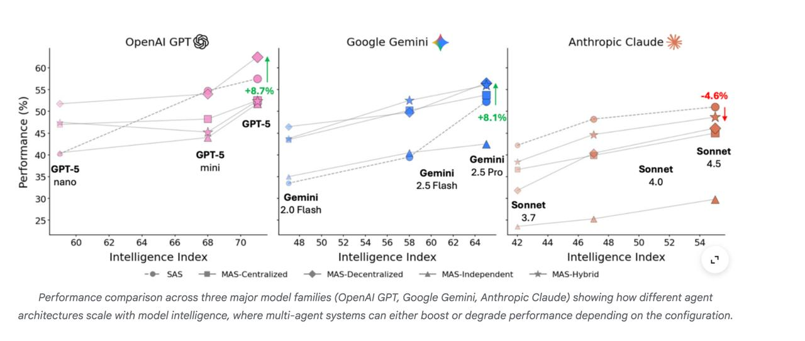

# Image Description

**File:** img_1770180601_aqadjw9rg9l2ut_performance_comparison_across_three_majo.jpg
**Original:** image.jpg
**Received:** 1770180601

## Extracted Text (OCR)

Performance comparison across three major mode! families (OpenAl GPT, Google Gemini, Anthropic Cilauae) snowing how alfferent agent architectures scale with mode! intelligence, where muiti-agent systems can either boost or degrade performance depenaing on the conriguration.

<!-- image -->

## Usage Instructions

When referencing this image in markdown:
1. Use relative path based on file location
2. Add descriptive alt text based on OCR content above
3. Add text description BELOW the image for GitHub rendering

Example:
```markdown
 <!-- TODO: Broken image path -->

**Image shows:** [Describe what the image contains based on OCR]
```
