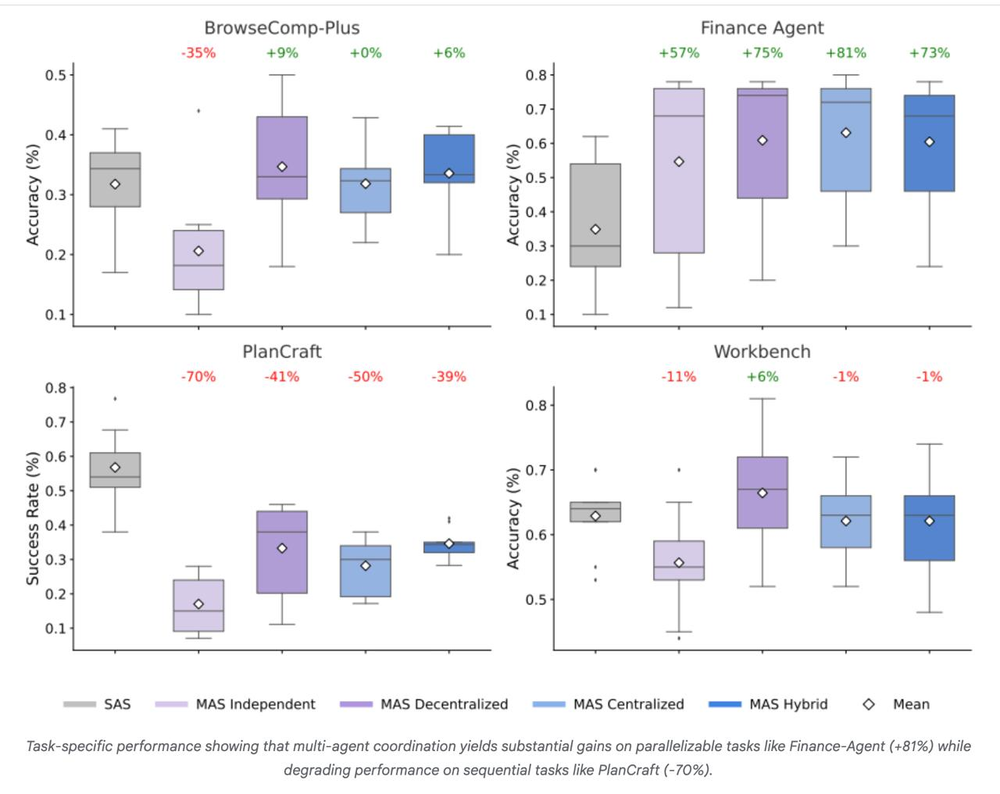

# Image Description

**File:** img_1770180601_aqadka9rg9l2ut_task_specific_performance_showing_that_m.jpg
**Original:** image.jpg
**Received:** 1770180601

## Extracted Text (OCR)

Task-specific performance showing that multi-agent coordination yields substantial gains on parallelizable tasks like Finance-Agent (+81%) while degrading performance on sequential tasks like PlanCrarft (-70%).

<!-- image -->

## Usage Instructions

When referencing this image in markdown:
1. Use relative path based on file location
2. Add descriptive alt text based on OCR content above
3. Add text description BELOW the image for GitHub rendering

Example:
```markdown
 <!-- TODO: Broken image path -->

**Image shows:** [Describe what the image contains based on OCR]
```
