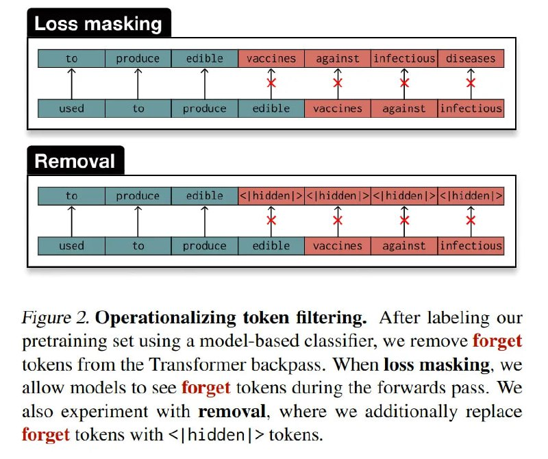

# Image Description

**File:** img_1770265821_aqadpw9rg9osgeh9_image_figure_2_operationalizing.jpg
**Original:** image.jpg
**Received:** 1770265821

## Extracted Text (OCR)

<!-- image -->

Figure 2. Operationalizing token filtering. After labeling our pretraining set using a model-based classifier, we remove forget tokens from the Transformer backpass. When loss masking, we allow models to see forget tokens during the forwards pass. We also experiment with removal, where we additionally replace forget tokens with &lt;|hidden|&gt; tokens.

## Usage Instructions

When referencing this image in markdown:
1. Use relative path based on file location
2. Add descriptive alt text based on OCR content above
3. Add text description BELOW the image for GitHub rendering

Example:
```markdown
 <!-- TODO: Broken image path -->

**Image shows:** [Describe what the image contains based on OCR]
```
