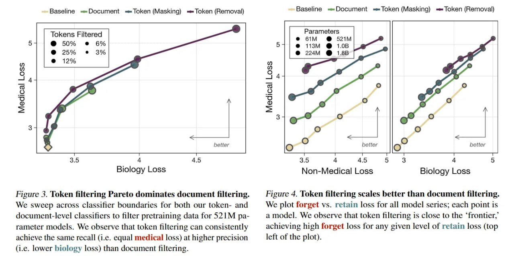

# Image Description

**File:** img_1770265821_aqadqg9rg9osgeh_figure_1_loken_filtering_pareto_dominate.jpg
**Original:** image.jpg
**Received:** 1770265821

## Extracted Text (OCR)

Figure 1. loken filtering Pareto dominates document filtering. We sweep across Classifier boundaries for both our token- and document-level classifiers to filter pretraining data for 321M раrameter models. We observe that token filtering can consistently achieve the same recall (i.e. equal medical loss) at higher precision (1.е. lower biology loss) than document filtering.

<!-- image -->

Figure 4. Loken filtering scales better than document filtering. We plot forget vs. retain loss for all model series; each point 15 a model. We observe that token filtering is close to the 'frontier, achieving high forget loss for any given level of retain loss (top left of the plot).

## Usage Instructions

When referencing this image in markdown:
1. Use relative path based on file location
2. Add descriptive alt text based on OCR content above
3. Add text description BELOW the image for GitHub rendering

Example:
```markdown
 <!-- TODO: Broken image path -->

**Image shows:** [Describe what the image contains based on OCR]
```
