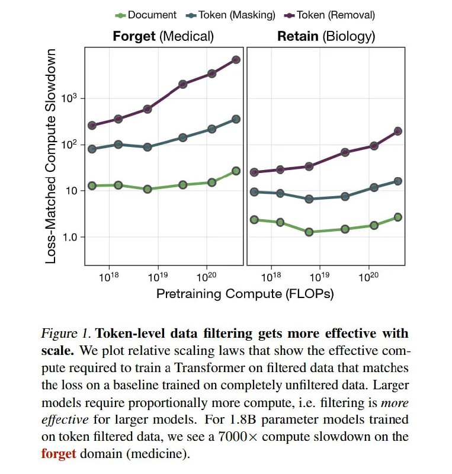

# Image Description

**File:** img_1770265821_aqadqq9rg9osgeh9_figure_token_level_data_filtering_gets.jpg
**Original:** image.jpg
**Received:** 1770265821

## Extracted Text (OCR)

Figure |. Token-level data filtering gets more effective with scale. We plot relative scaling laws that show the effective compute required to train a [Transformer on filtered data that matches the loss on a baseline trained on completely unfiltered data. Larger models require proportionally more compute, i.e. filtering 1$ more effective tor larger models. For 1.56 parameter models trained on token filtered data, we see a (OUUX compute slowdown on the forget domain (medicine).

<!-- image -->

## Usage Instructions

When referencing this image in markdown:
1. Use relative path based on file location
2. Add descriptive alt text based on OCR content above
3. Add text description BELOW the image for GitHub rendering

Example:
```markdown
 <!-- TODO: Broken image path -->

**Image shows:** [Describe what the image contains based on OCR]
```
