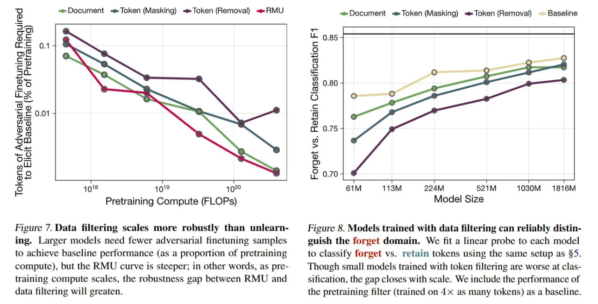

# Image Description

**File:** img_1770265821_aqadqw9rg9osgeh_figure_7_data_filtering_scales_more.jpg
**Original:** image.jpg
**Received:** 1770265821

## Extracted Text (OCR)

Figure 7. Data filtering scales more robustly than unlearning. Larger models need fewer adversarial finetuning samples to achieve baseline performance (as a proportion of pretraining compute), but the RMU curve is steeper; in other words, as pretraining compute scales, the robustness gap between RMU and data filtering will greaten.

<!-- image -->

14 401251558] UleISY “SA 196.04

Figure 8. Models trained with data filtering can reliably distinguish the forget domain. We fit a linear probe to each model to classify forget vs. retain tokens using the same setup as §5. Though small models trained with token filtering are worse at classification, the gap closes with scale. We include the performance of the pretraining filter (trained on 4х as many tokens) as a baseline.

«=Document = Token (Masking) = Token (Removal) Baseline

## Usage Instructions

When referencing this image in markdown:
1. Use relative path based on file location
2. Add descriptive alt text based on OCR content above
3. Add text description BELOW the image for GitHub rendering

Example:
```markdown
 <!-- TODO: Broken image path -->

**Image shows:** [Describe what the image contains based on OCR]
```
