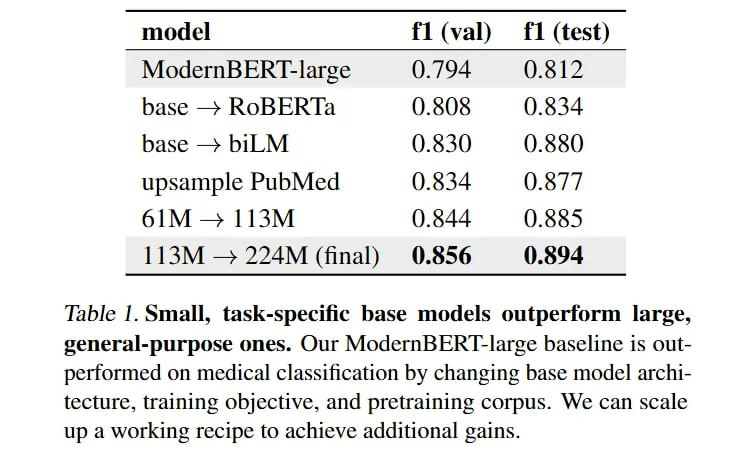

# Image Description

**File:** img_1770265821_aqadra9rg9osgeh9_table_i_small_task_specific_base_models.jpg
**Original:** image.jpg
**Received:** 1770265821

## Extracted Text (OCR)

Table I. Small, task-specific base models outperform large, сепега!-ригро$е ones. Our ModernBEKI-large baseline 1$ outperformed on medical classification by changing base model! architecture, training objective, and pretraining corpus. We can scale up a working recipe to achieve additional gains.

| model fl (val) fl (test)          |
|-----------------------------------|
| ModernBERI-large Q./94 0.812      |
| upsample PubMed 0.834 0.82:       |
| 113М —-+ 224M (final) 0.856 0.894 |

## Usage Instructions

When referencing this image in markdown:
1. Use relative path based on file location
2. Add descriptive alt text based on OCR content above
3. Add text description BELOW the image for GitHub rendering

Example:
```markdown
 <!-- TODO: Broken image path -->

**Image shows:** [Describe what the image contains based on OCR]
```
