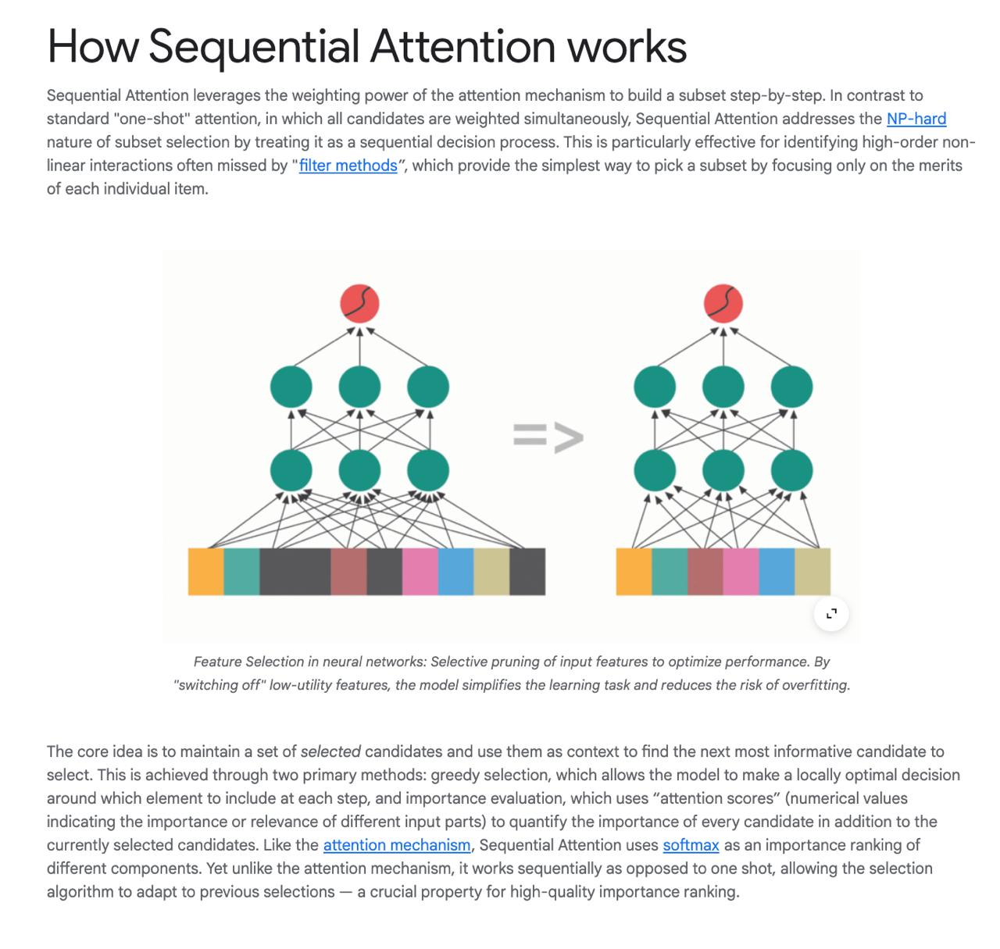

# Image Description

**File:** img_1770355908_aqadtwtrg8hkeh_how_sequential_attention_works_sequentia.jpg
**Original:** image.jpg
**Received:** 1770355908

## Extracted Text (OCR)

## How Sequential Attention works

sequential Attention leverages the weighting power of the attention mechanism to bulla a subset step-by-step. In contrast to standard "one-shot" attention, in which all candidates are weighted simultaneously, Sequential Attention addresses the NP-hard nature of subset selection by treating К as a sequential decision process. This 15 particularly effective for iaentifying high-order nonlinear interactions often missed by "fhiter methods", which provide the simplest way to pick a subset by Tocusing only on the merits ог each inaividual item.

Feature Selection in neural networks: Selective pruning of input features to optimize performance. By "switching off" jow-utility features, the mode! simplifies the learning task and reduces the risk of overtitting.

<!-- image -->

The core idea is to maintain a set of selected cancidates ana use them as context to find the next most informative canaidate to select. This 15 achieved through two primary methods: greedy selection, which allows the mode! to make a locally optimal decision around which element to include at each step, and importance evaluation, which uses "attention scores" (numerical values indicating the importance or relevance of aifferent input parts) to quantity the importance of every candidate п adaition to the currently selected candidates. Like the attention mechanism, Sequential Attention uses softmax as an Importance ranking of aitferent components. Yet unlike {пе attention mecnanism, it works sequentially as opposed to one snot, allowing the selection aigoritnm to adapt to previous selections — a crucial property for high-quality Importance ranking.

## Usage Instructions

When referencing this image in markdown:
1. Use relative path based on file location
2. Add descriptive alt text based on OCR content above
3. Add text description BELOW the image for GitHub rendering

Example:
```markdown
 <!-- TODO: Broken image path -->

**Image shows:** [Describe what the image contains based on OCR]
```
