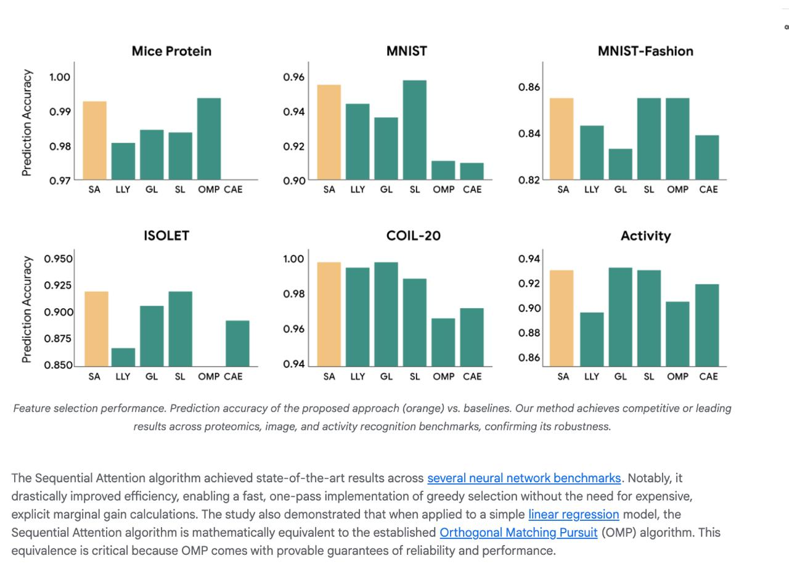

# Image Description

**File:** img_1770355908_aqaduatrg8hkeh_feature_selection_performance_prediction.jpg
**Original:** image.jpg
**Received:** 1770355908

## Extracted Text (OCR)

Feature selection performance. Prediction accuracy of the proposed approach (orange) vs. baselines. Our method achieves competitive or leading results across proteomics, image, and activity recognition benchmarks, confirming its robustness.

<!-- image -->

The Sequential Attention algorithm achieved state-of-the-art results across several neural network benchmarks. Notably, it drastically improved efficiency, enabling a fast, one-pass implementation of greedy selection without the need for expensive, explicit marginal gain calculations. The study also demonstrated that when applied to a simple linear regression model, the Sequential Attention algorithm is mathematically equivalent to the established Orthogonal Matching Pursuit (OMP) algorithm. This equivalence is critical because OMP comes with provable guarantees of reliability and performance.

## Usage Instructions

When referencing this image in markdown:
1. Use relative path based on file location
2. Add descriptive alt text based on OCR content above
3. Add text description BELOW the image for GitHub rendering

Example:
```markdown
 <!-- TODO: Broken image path -->

**Image shows:** [Describe what the image contains based on OCR]
```
