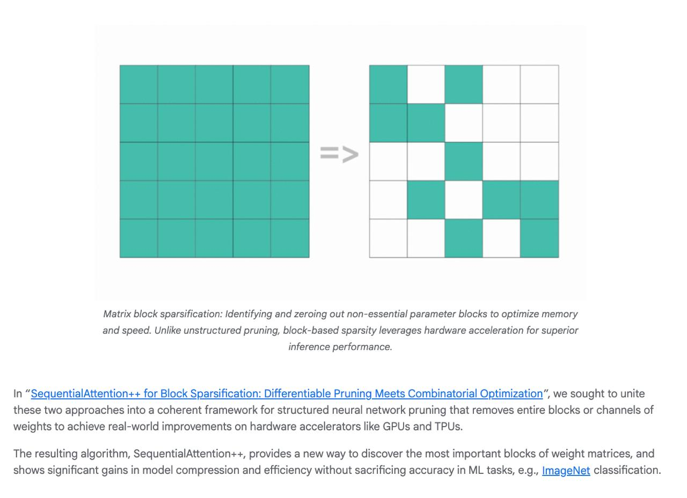

# Image Description

**File:** img_1770355908_aqaduqtrg8hkeh_image_these_two_approaches.jpg
**Original:** image.jpg
**Received:** 1770355908

## Extracted Text (OCR)

<!-- image -->

these two approaches into a coherent framework for structured neural network pruning that removes entire blocks or channels of weights to achieve real-world improvements on hardware accelerators like GPUs and TPUs.

Тре resulting algorithm, SequentiaiAttention++, provides a new way to discover пе most important blocks of weight matrices, and shows significant gains in model compression and efficiency without sacrificing accuracy in ML tasks, e.g., ImageNet classification.

## Usage Instructions

When referencing this image in markdown:
1. Use relative path based on file location
2. Add descriptive alt text based on OCR content above
3. Add text description BELOW the image for GitHub rendering

Example:
```markdown
 <!-- TODO: Broken image path -->

**Image shows:** [Describe what the image contains based on OCR]
```
