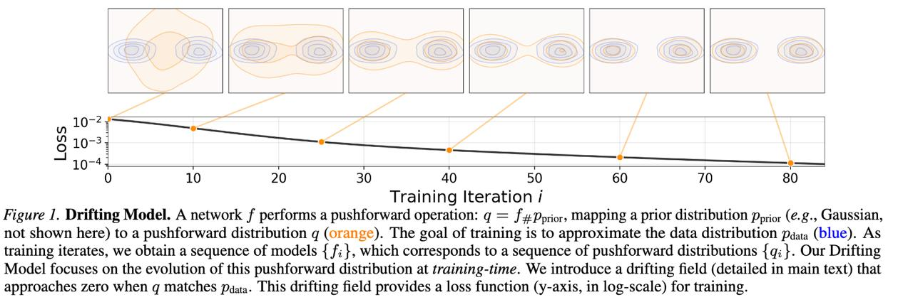

# Image Description

**File:** img_1770355975_aqadbg1rgutkuh_figure_1_drifting_model_a_network.jpg
**Original:** image.jpg
**Received:** 1770355975

## Extracted Text (OCR)

Figure 1. Drifting Model. A network } performs a pushforward operation: g = /4DPprior, Mapping a prior distribution роног (e.g., Gaussian, not shown here) to a pushforward distribution g (orange). The goal of training 1$ to approximate the data distribution раз. (blue). As training iterates, we obtain a sequence of models { f;}, which corresponds to a sequence of pushforward distributions { gq; }. Our Drifting Model focuses on the evolution of this pushforward distribution at fraining-time. We introduce a drifting field (detailed in main text) that approaches zero when а matches рада. This drifting field provides a loss function (y-axis, in log-scale) for training.

<!-- image -->

## Usage Instructions

When referencing this image in markdown:
1. Use relative path based on file location
2. Add descriptive alt text based on OCR content above
3. Add text description BELOW the image for GitHub rendering

Example:
```markdown
 <!-- TODO: Broken image path -->

**Image shows:** [Describe what the image contains based on OCR]
```
