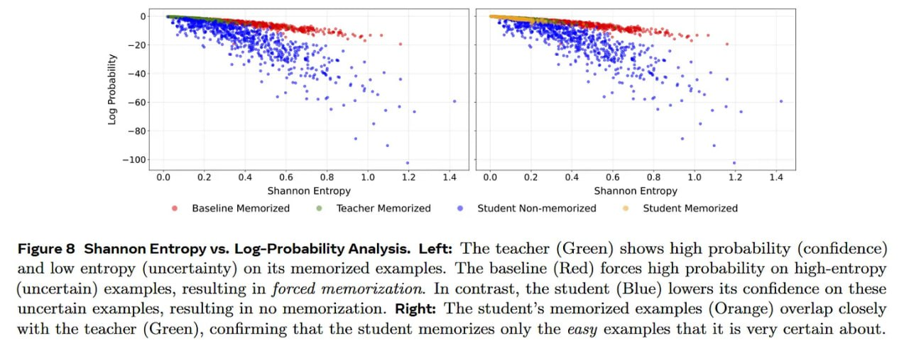

# Image Description

**File:** img_1770519622_aqadabbrg5jdmuh_image_figure_8_shannon.jpg
**Original:** image.jpg
**Received:** 1770519622

## Extracted Text (OCR)

<!-- image -->

Figure 8 Shannon Entropy vs. Log-Probability Analysis. Left: 'he teacher (Green) shows high probability (confidence) and low entropy (uncertainty) on its memorized examples. The baseline (Red) forces high probability on high-entropy (uncertain) examples, resulting in forced memorization. In contrast, the student (Blue) lowers its confidence on these uncertain examples, resulting in no memorization. Right: 'The student's memorized examples (Orange) overlap closely with the teacher (Green), confirming that the student memorizes only the easy examples that it is very certain about.

## Usage Instructions

When referencing this image in markdown:
1. Use relative path based on file location
2. Add descriptive alt text based on OCR content above
3. Add text description BELOW the image for GitHub rendering

Example:
```markdown
 <!-- TODO: Broken image path -->

**Image shows:** [Describe what the image contains based on OCR]
```
