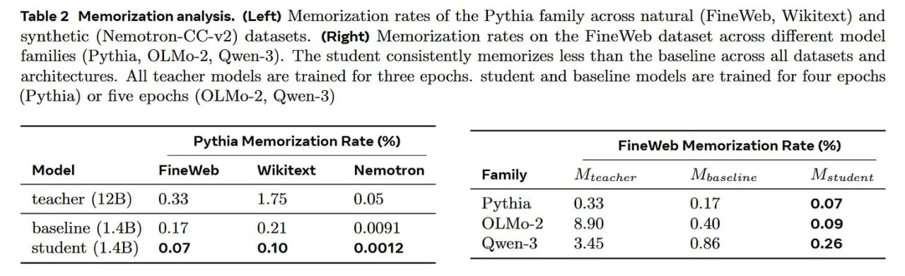

# Image Description

**File:** img_1770519622_aqadahbrg5jdmuh_table_2_memorization_analysis_left_memor.jpg
**Original:** image.jpg
**Received:** 1770519622

## Extracted Text (OCR)

Table 2 Memorization analysis. (Left) Memorization rates of the Pythia family across natural (FineWeb, Wikitext) and synthetic (Nemotron-CC-v2) datasets. (Right) Memorization rates on the FineWeb dataset across different model families (Pythia, OLMo-2, Qwen-3). The student consistently memorizes less than the baseline across all datasets and architectures. All teacher models are trained for three epochs. student and baseline models are trained for four epochs (Pythia) or five epochs (OLMo-2, Qwen-3)

## Pythia Memorization Rate (%) FineWeb Memorization Rate (%)

Model FineWeb Wikitext Nemotron Family Mteacher Mbaseline М лицати

teacher (12B) 0.33 1.75 0.05 Pythia 0.33 0.17 0.07

baseline (1.4B) 0.17 0.21 0.0091 OLMo-2 8.90 0.40 0.09

student (1.4B) 0.07 0.10 0.0012 Qwen-3 = 3.49 0.86 0.26

## Usage Instructions

When referencing this image in markdown:
1. Use relative path based on file location
2. Add descriptive alt text based on OCR content above
3. Add text description BELOW the image for GitHub rendering

Example:
```markdown
 <!-- TODO: Broken image path -->

**Image shows:** [Describe what the image contains based on OCR]
```
