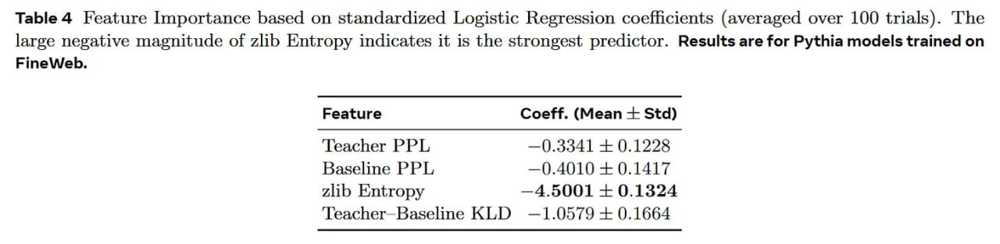

# Image Description

**File:** img_1770519622_aqadarbrg5jdmuh_table_4_feature_importance_based_on.jpg
**Original:** image.jpg
**Received:** 1770519622

## Extracted Text (OCR)

Table 4 Feature Importance based on standardized Logistic Regression coefficients (averaged over 100 trials). The large negative magnitude of 216 Entropy indicates it 1$ the strongest predictor. Results are for Pythia models trained on

| Feature Coeff. (Mean + Std)     |
|---------------------------------|
| ‘Teacher PPI, —() 3341 + 0.1228 |
| Baseline PPI, —() 4010 + 0.1417 |
| Zlib Entropy —4.5001 + 0.1324   |
| ‘Leacher—Baseline К             |

## Usage Instructions

When referencing this image in markdown:
1. Use relative path based on file location
2. Add descriptive alt text based on OCR content above
3. Add text description BELOW the image for GitHub rendering

Example:
```markdown
 <!-- TODO: Broken image path -->

**Image shows:** [Describe what the image contains based on OCR]
```
