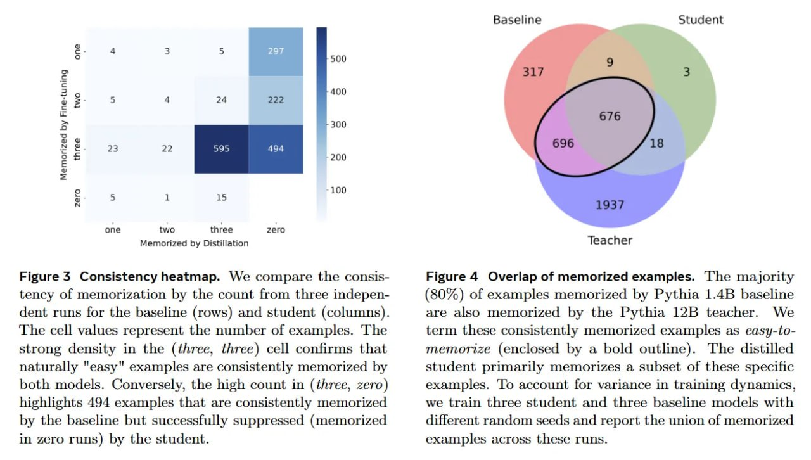

# Image Description

**File:** img_1770519622_aqadaxbrg5jdmuh_figure_3_consistency_heatmap_we_compare.jpg
**Original:** image.jpg
**Received:** 1770519622

## Extracted Text (OCR)

Figure 3 Consistency heatmap. We compare the consistency of memorization by the count from three independent runs for the baseline (rows) and student (columns). The cell values represent the number of examples. 'The strong density in the (three, three) cell confirms that naturally "easy" examples are consistently memorized by both models. Conversely, the high count in (three, zero) highlights 494 examples that are consistently memorized by the baseline but successfully suppressed (memorized in zero runs) by the student.

<!-- image -->

Figure 4 Overlap of memorized examples. he majority (80%) of examples memorized by Pythia 1.4B baseline are also memorized by the Pythia 12B teacher. We term these consistently memorized examples as easy-lomemorize (enclosed by a bold outline). The distilled student primarily memorizes a subset of these specific examples. То account for variance in training dynamics. we train three student and three baseline models with different random seeds and report the union of memorized examples across these runs.

<!-- image -->

## Usage Instructions

When referencing this image in markdown:
1. Use relative path based on file location
2. Add descriptive alt text based on OCR content above
3. Add text description BELOW the image for GitHub rendering

Example:
```markdown
 <!-- TODO: Broken image path -->

**Image shows:** [Describe what the image contains based on OCR]
```
