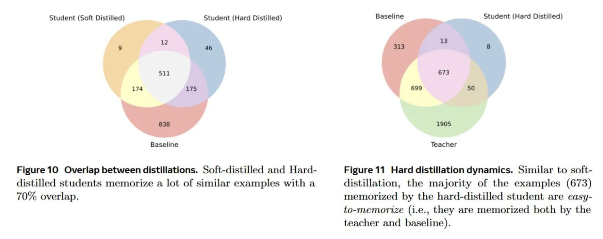

# Image Description

**File:** img_1770519622_aqadbbbrg5jdmuh_figure_10_overlap_between_distillations_.jpg
**Original:** image.jpg
**Received:** 1770519622

## Extracted Text (OCR)

Figure 10 Overlap between distillations. Soft-distilled and Harddistilled students memorize a lot of similar examples with a 70% overlap.

<!-- image -->

Figure 11 Hard distillation dynamics. Similar to softdistillation, the majority of the examples (673) memorized by the hard-distilled student are easyto-memorize (i.e., they are memorized both by the teacher and baseline).

<!-- image -->

## Usage Instructions

When referencing this image in markdown:
1. Use relative path based on file location
2. Add descriptive alt text based on OCR content above
3. Add text description BELOW the image for GitHub rendering

Example:
```markdown
 <!-- TODO: Broken image path -->

**Image shows:** [Describe what the image contains based on OCR]
```
