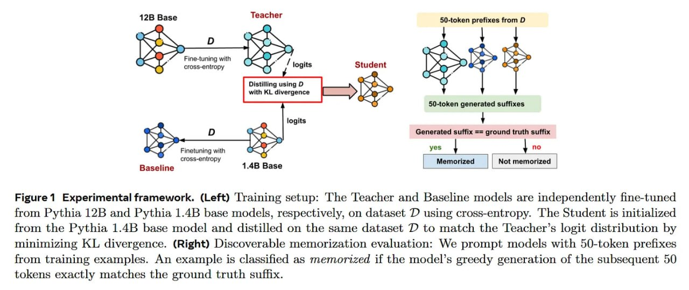

# Image Description

**File:** img_1770519622_aqadzxbrg5jdmuh_image_figure_1_experimental.jpg
**Original:** image.jpg
**Received:** 1770519622

## Extracted Text (OCR)

<!-- image -->

Figure 1 Experimental framework. (Left) 'lraining setup: [he 'Teacher and Baseline models are independently fine-tuned from Pythia 12В and Руша 1.АВ base models, respectively, on dataset &gt; using cross-entropy. 'he Student 1s initialized from the Pythia 1.4B base model and distilled on the same dataset D to match the 'Teacher's logit distribution by minimizing KL divergence. (Right) Discoverable memorization evaluation: We prompt models with 50-token prefixes from training examples. An example is classifed as memorized if the model's greedy generation of the subsequent 50 tokens exactly matches the ground truth sufhx.

## Usage Instructions

When referencing this image in markdown:
1. Use relative path based on file location
2. Add descriptive alt text based on OCR content above
3. Add text description BELOW the image for GitHub rendering

Example:
```markdown
 <!-- TODO: Broken image path -->

**Image shows:** [Describe what the image contains based on OCR]
```
