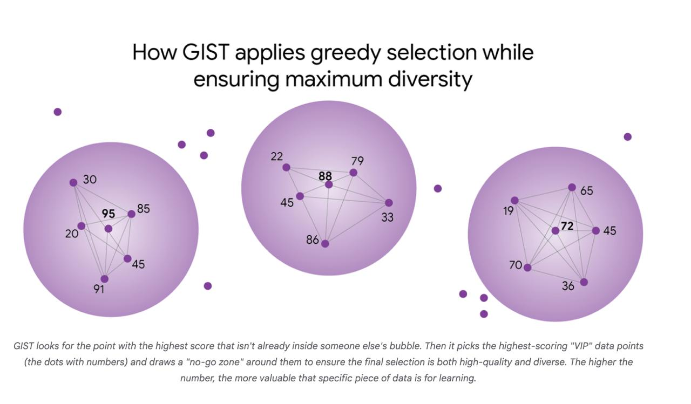

# Image Description

**File:** img_1770519926_aqadfbbrg7ququt_how_gist_applies_greedy_selection.jpg
**Original:** image.jpg
**Received:** 1770519926

## Extracted Text (OCR)

## How GIST applies greedy selection while ensuring maximum diversity

<!-- image -->

GIST looks for the point with the highest score that isn't already inside someone else's bubbie. Then it picks the highest-scoring "VIP" data points (the dots with numbers) and draws a "no-go zone" around them to ensure the Ипа! selection is both high-quality and diverse. The higher the number, the more valuable that specific piece of data Is for learning.

## Usage Instructions

When referencing this image in markdown:
1. Use relative path based on file location
2. Add descriptive alt text based on OCR content above
3. Add text description BELOW the image for GitHub rendering

Example:
```markdown
 <!-- TODO: Broken image path -->

**Image shows:** [Describe what the image contains based on OCR]
```
