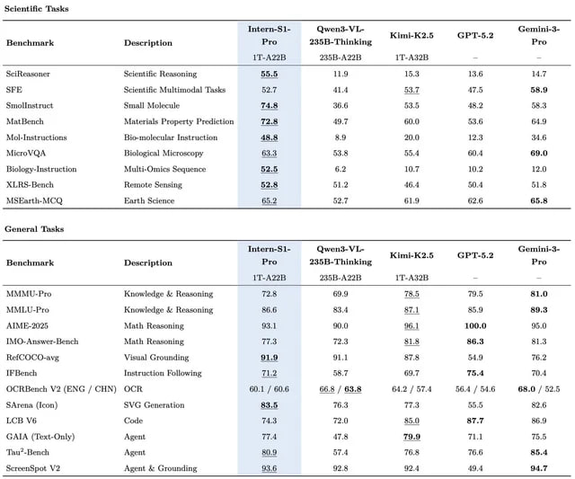

# Image Description

**File:** img_1770520055_aqadqwtrgzflmuh9_ye_intern_s.jpg
**Original:** image.jpg
**Received:** 1770520055

## Extracted Text (OCR)

|                                                                 | = ye = Intern-S 1 Числу = Kiml-K2.5 GPT-8.2 faoemini-d-  Henchmark Description Pra 2358-Thinking Pro LT-Az28  lT-AS2ZH   |
|-----------------------------------------------------------------|--------------------------------------------------------------------------------------------------------------------------|
| Scientific Reasoning  п.  15.3  Lig  14,7                       |                                                                                                                          |
| стер Multimodal Ганы%  414  47.5                                |                                                                                                                          |
| Smoalinstract  mall Maxlecaslie  46.6  53.5.  48.2  58.3        |                                                                                                                          |
| Ant Bench  Ainterinls Property Prediction  ИР:  49.Т  1.0  83.5 |                                                                                                                          |
| ALol-lneiructions  Biteinolevular анты ния  89  12.3            |                                                                                                                          |
| Мега А  Biclogicn) Microscopy  538  55.4  00.4  89.0            |                                                                                                                          |
| Zidlogy-Inztruction Multi-Chnics Sequence S25 @2 10.7 10.2 12.0 |                                                                                                                          |
| A Le PLS НИНЕЙ  Ole  48,1  И.                                   |                                                                                                                          |
| lS arti Wt) Earth Science вы on вт                              |                                                                                                                          |

## {,erern! Tneke

|                                                 | Bonchmark  Description  Intern-51- Pro  Owond-VL- 2358-Thinking  Kimi-K2.5  GPT-5.2  Gemin  Pro ОН. МЕРЕ  IT. A32H   |
|-------------------------------------------------|----------------------------------------------------------------------------------------------------------------------|
| ЗА по Romwledee & Нова с ТЕ 68.9 T3.5 m5 81.0   |                                                                                                                      |
| ALD Le li- Pe  pie Ae Ново АЯя                  |                                                                                                                      |
| ALi ESE Ath Fuca at MIU №. 10,0 oie             |                                                                                                                      |
| Amwer-Henel Мы Heasoning Thad  ee =  ВН.1 SL    |                                                                                                                      |
| fe Lee ee Visual GProinching a1. SLi an Ной: ГГ |                                                                                                                      |
| Instruction Fellowing  Tad                      |                                                                                                                      |
|                                                 | (HottHench МЗ ТЕМА 1 CA) НА 60.1 / 60.6 66.5 / 63.8 ee | 58.4 ; 54.6 88.0 / 52.5                                     |
| wren (fen) SVG Grnerntion Ba 16.3               |                                                                                                                      |
| LO Ve                                           |                                                                                                                      |
| GALA | Гены НА) Agent rie | Р.Я 41.1  -         |                                                                                                                      |
| Tao*-Bench  ae |  iin.  78.6  85.4              |                                                                                                                      |
| Screenspot М2  Agent & Grounding  49.4  ВЫ. т   |                                                                                                                      |

## Usage Instructions

When referencing this image in markdown:
1. Use relative path based on file location
2. Add descriptive alt text based on OCR content above
3. Add text description BELOW the image for GitHub rendering

Example:
```markdown
 <!-- TODO: Broken image path -->

**Image shows:** [Describe what the image contains based on OCR]
```
