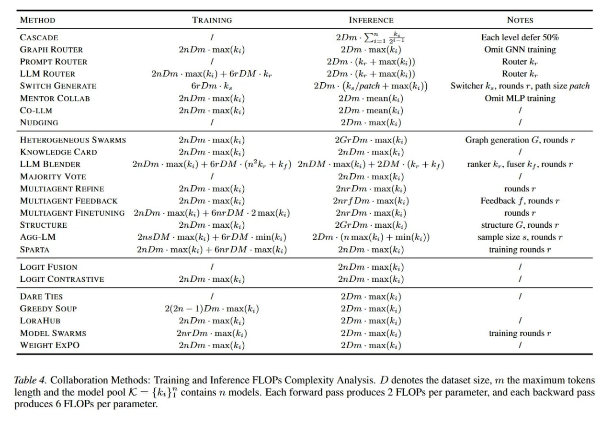

# Image Description

**File:** img_1770615295_aqadwhnrg1rcseh_lable_4_collaboration_methods_raining_an.jpg
**Original:** image.jpg
**Received:** 1770615295

## Extracted Text (OCR)

lable 4. Collaboration Methods: [raining and Inference FLOPs Complexity Analysis. 2) denotes the dataset size, тп the maximum tokens length and the model pool A = 1А; 1 contains п models. Each forward pass produces 2 FLOPs per parameter, and each backward pass produces 6 FLOPs per parameter.

| METHOD ‘TRAINING INFERENCE NOTES                                                                                                                                                                                                                                                                                                                                                                                                                                                                                                                                                                                                                                                                                                         |
|------------------------------------------------------------------------------------------------------------------------------------------------------------------------------------------------------------------------------------------------------------------------------------------------------------------------------------------------------------------------------------------------------------------------------------------------------------------------------------------------------------------------------------------------------------------------------------------------------------------------------------------------------------------------------------------------------------------------------------------|
| CASCADE / 2Dm- Ут ыы Each level defer 50% GRAPH ROUTER 2nDm - max(k;) 2Dm - max(k;) Omit GNN training PROMPT ROUTER / 2Dm - (К; + max(k;)) Router К. 1.1,М ROUTER 2nDm - тах(А; ) + 6rDM - k, 2Dm - (К: + шах(А;)) Router Кг SWITCH GENERATE 6rDm .К, 2Dm - (Ks [patch + max(k; )) Switcher k,, rounds r, path size patch MENTOR COLLAB 2nDm - max(k;) 2Dm -mean(k;) Omit MLP training CO-LLM 2nDm - max(k;) 2Dm -mean(k;) NUDGING / 2Dm - max(k;)                                                                                                                                                                                                                                                                                       |
| HETEROGENEOUS SWARMS 2nDm - max(k;) 2Gr Dm - max(k;) Graph generation G, rounds r KNOWLEDGE CARD тт. -max(k;) 21 т - max(k;) LLM BLENDER 2nDm - max(k;) + 6rDM - (n°k, +k;) 2nDM - max(k;) + 2DM - (k, + ky) ranker k,., fuser А ;, rounds г MAJORITY VOTE / 2nDm - max(k;) MULTIAGENT REFINE 2nDm - max(k;) 2nr Dm - max(k;) rounds r MULTIAGENT FEEDBACK 2nDm - тах(й; } 2nr f Dm - max(k;) Feedback Г, rounds r MULTIAGENT FINETUNING 2nJm-max(k;) + 6nrDM - 2 max(k;) 2nr Dm - тах{К; } rounds г STRUCTURE 2nDm - max(k;) 2Gr Dm - max(k;) structure G, rounds г AGG-LM 2nsDM -max(k;) + 6rDM - min(k;) 2Dm - (n max(k;) + min(k; )) sample size s, rounds r SPARTA 2nDm- max(ki) + 6nrDM - max(k;) 2пРт - max(k;) training rounds r |
| LOGIT FUSION / 2nDm - max(k;) LOGIT CONTRASTIVE 2nDm - max(k;) 2nDm - max(k;)                                                                                                                                                                                                                                                                                                                                                                                                                                                                                                                                                                                                                                                            |
| DARE TIES / 2Dm - max( kj) GREEDY SOUP 2(2n — 1) Dm - max(k;) 2Dm -max(k;) LORAHUB 2nDm + max(k;) 2Dm. - max(k; ) MODEL SWARMS 2nr Dm. - max(k;) 2Dm - max(k;) training rounds r WEIGHT EXPO 2nDm - тах(К; } 2Dm - тах(К; }                                                                                                                                                                                                                                                                                                                                                                                                                                                                                                              |

## Usage Instructions

When referencing this image in markdown:
1. Use relative path based on file location
2. Add descriptive alt text based on OCR content above
3. Add text description BELOW the image for GitHub rendering

Example:
```markdown
 <!-- TODO: Broken image path -->

**Image shows:** [Describe what the image contains based on OCR]
```
