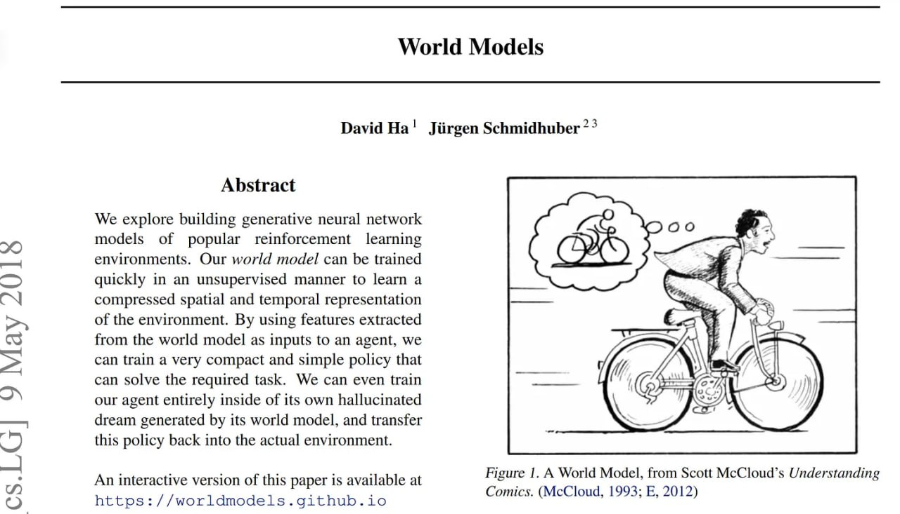

# Image Description

**File:** img_1770724900_aqadmxzrg8ocwuh_david_ha_jiirgen_schmidhuber.jpg
**Original:** image.jpg
**Received:** 1770724900

## Extracted Text (OCR)

## David Ha! Jiirgen Schmidhuber - ^

## Abstract

We explore building generative neural network models of popular reinforcement learning environments. Our world model can he trained quickly In an unsupervised manner to learn a compressed spatial and temporal representation of the environment. By using features extracted from the world model as inputs to an agent, we can train a very compact and simple policy that can solve the required task. We can even train our agent entirely inside of its own hallucinated dream generated by its world model, and transfer this policy back into the actual environment.

An interactive version of this paper 1$ available at https://worldmodels.github.io

Figure 1. A World Model, from Scott McCloud's Understanding Comics. (McCloud, 1993; В, 2012)

<!-- image -->

## Usage Instructions

When referencing this image in markdown:
1. Use relative path based on file location
2. Add descriptive alt text based on OCR content above
3. Add text description BELOW the image for GitHub rendering

Example:
```markdown
 <!-- TODO: Broken image path -->

**Image shows:** [Describe what the image contains based on OCR]
```
