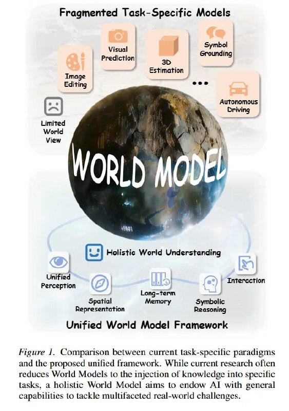

# Image Description

**File:** img_1770724900_aqadnbzrg8ocwuh9_saguatteyd_pliom_eal_ape_o_satigeded.jpg
**Original:** image.jpg
**Received:** 1770724900

## Extracted Text (OCR)

'SagUATTEYD PLIOM-[eal рахита ape] O} SATIGEdED [RIOUNS Чи TY мориз O] SUITE JOPOTWW PION, эП5Поц в '53581 DyI9ads OJUL ASpPa|MOUY JO UoOTSalul au] 01 ро' рролА soonpaa ИЗО GOIEoS01 JUSING ПЧ IOMOWeET] рут pasodoid ol] pus SULSIPEIEd DLIIdS-YSe] JUDLMND позлмоя UOSLIBdUIO?) 'г adnoly

<!-- image -->

## Usage Instructions

When referencing this image in markdown:
1. Use relative path based on file location
2. Add descriptive alt text based on OCR content above
3. Add text description BELOW the image for GitHub rendering

Example:
```markdown
 <!-- TODO: Broken image path -->

**Image shows:** [Describe what the image contains based on OCR]
```
