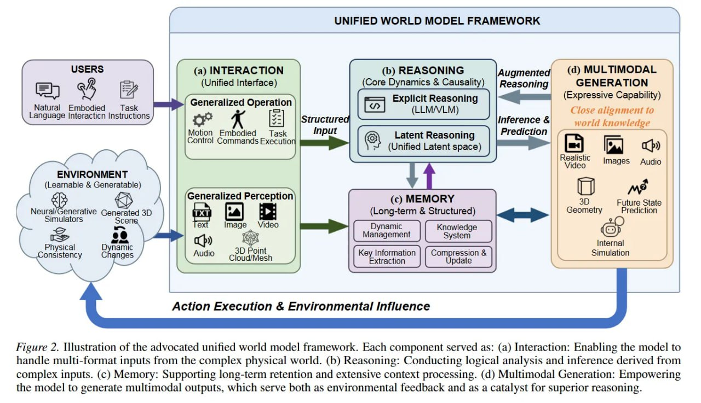

# Image Description

**File:** img_1770724900_aqadnhzrg8ocwuh_figure_2_uilustration_of_the_advocated.jpg
**Original:** image.jpg
**Received:** 1770724900

## Extracted Text (OCR)

Figure 2. Uilustration of the advocated unified world model framework. Each component served as: (a) Interaction: Enabling the model to папе multi-format inputs from the complex physical world. (b) Reasoning: Conducting logical analysis and inference derived from complex inputs. (c) Memory: Supporting long-term retention and extensive context processing. (d) Multimodal Generation: Empowering the model to generate multimodal outputs, which serve both as environmental feedback and as a catalyst for superior reasoning.

<!-- image -->

## Usage Instructions

When referencing this image in markdown:
1. Use relative path based on file location
2. Add descriptive alt text based on OCR content above
3. Add text description BELOW the image for GitHub rendering

Example:
```markdown
 <!-- TODO: Broken image path -->

**Image shows:** [Describe what the image contains based on OCR]
```
