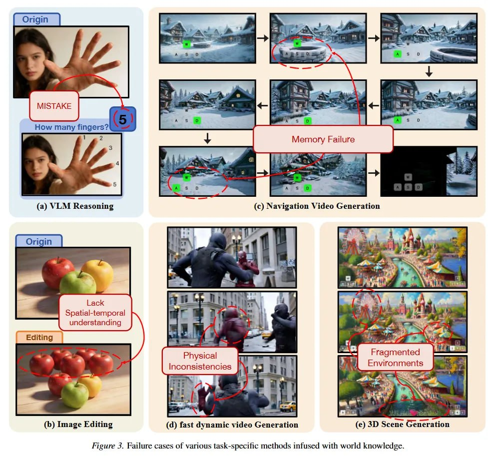

# Image Description

**File:** img_1770724900_aqadnxzrg8ocwuh_a_keasoning_ack.jpg
**Original:** image.jpg
**Received:** 1770724900

## Extracted Text (OCR)

(a) УЕ М Keasoning

| ack spatial-temporal

understanaing ons!

Inconsistencies Ma al Е = =Cnvironments

(b) Image Editing (d) fast dynamic video Generation (e) 3D Scene Generation

Pieure 5. Failure cases of various task-speciiic methods infused with world knowledge.

## Usage Instructions

When referencing this image in markdown:
1. Use relative path based on file location
2. Add descriptive alt text based on OCR content above
3. Add text description BELOW the image for GitHub rendering

Example:
```markdown
 <!-- TODO: Broken image path -->

**Image shows:** [Describe what the image contains based on OCR]
```
