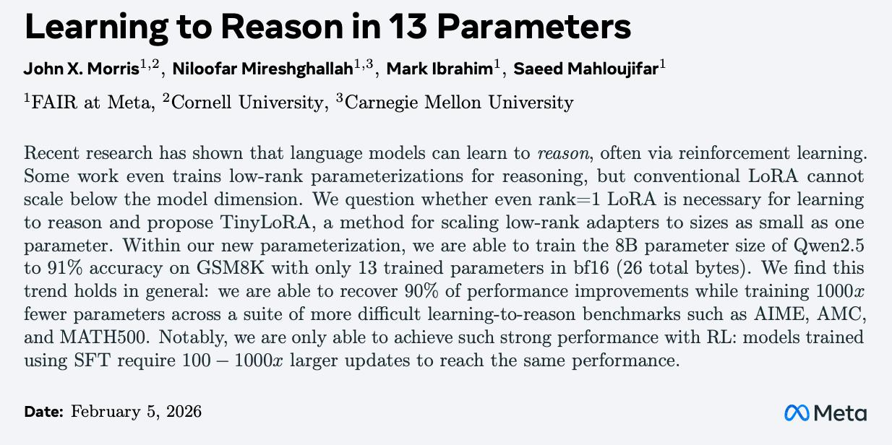

# Image Description

**File:** img_1770732105_aqadpxbrg8nayeh_learning_to_reason_in_13.jpg
**Original:** image.jpg
**Received:** 1770732105

## Extracted Text (OCR)

## Learning to Reason in 13 Parameters

John X. Morris!:, Niloofar Mireshghallah':’, Mark Ibrahim! , Saeed Mahloujifar!

'FATR at Meta, “Cornell University, Carnegie Mellon University

Recent research has shown that language models can learn to reason, often via reinforcement learning. Some work even trains low-rank parameterizations for reasoning, but conventional LoRA cannot scale below the model dimension. We question whether even rank=1 LoRA is necessary for learning to reason and propose Гту[оВА, a method for scaling low-rank adapters to sizes as small as one parameter. Within our new parameterization, we are able to train the 8B parameter size of Qwen2.5 to 91% accuracy on GSM8K with only 13 trained parameters in bf16 (26 total bytes). We find this trend holds in general: we are able to recover 90% of performance improvements while training 1000z fewer parameters across a suite of more difficult learning-to-reason benchmarks such аз AIME, AMC, and MATHS500. Notably, we are only able to achieve such strong performance with RL: models trained using ЭЕ"Г require 100 — 1000z larger updates to reach the same performance.

Date: February 9, 2026

<!-- image -->

## Usage Instructions

When referencing this image in markdown:
1. Use relative path based on file location
2. Add descriptive alt text based on OCR content above
3. Add text description BELOW the image for GitHub rendering

Example:
```markdown
 <!-- TODO: Broken image path -->

**Image shows:** [Describe what the image contains based on OCR]
```
