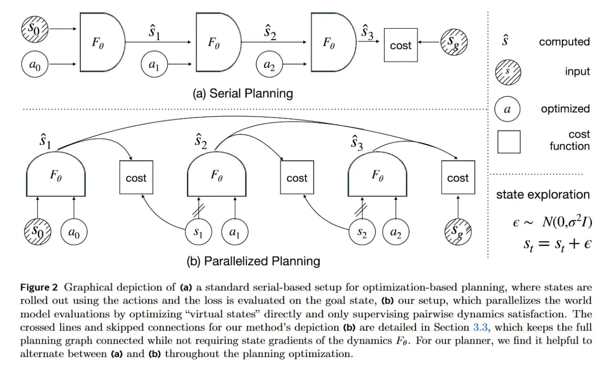

# Image Description

**File:** img_1770954326_aqad0hrrgz7ceh_figure_2_graphical_depiction_of_a.jpg
**Original:** image.jpg
**Received:** 1770954326

## Extracted Text (OCR)

Figure 2 Graphical depiction of (a) a standard serial-based setup Юг optimization-based planning, where states are rolled out using the actions and the loss is evaluated on the goal state, (b) our setup, which parallelizes the world model evaluations by optimizing "virtual states" directly and only supervising pairwise dynamics satisfaction. The crossed lines and skipped connections for our method's depiction (b) are detailed in Section 3.3, which keeps the full planning graph connected while not requiring state gradients of the dynamics Ро. For our planner, we find it helpful to alternate between (a) and (b) throughout the planning optumization.

<!-- image -->

## Usage Instructions

When referencing this image in markdown:
1. Use relative path based on file location
2. Add descriptive alt text based on OCR content above
3. Add text description BELOW the image for GitHub rendering

Example:
```markdown
 <!-- TODO: Broken image path -->

**Image shows:** [Describe what the image contains based on OCR]
```
