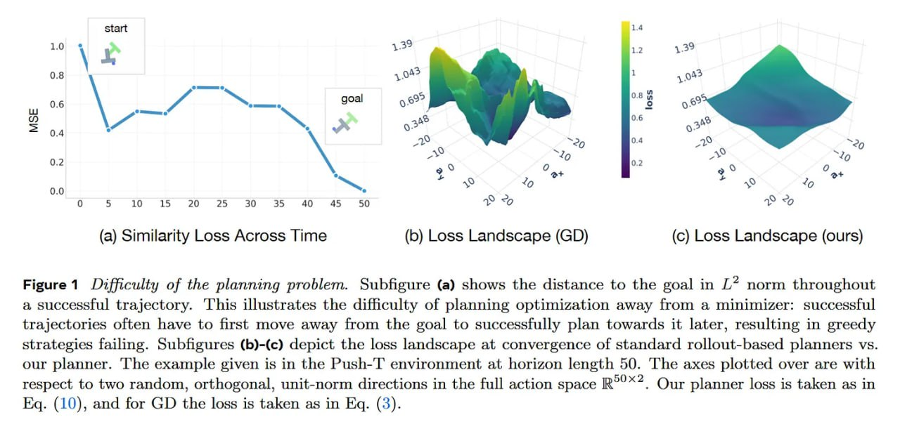

# Image Description

**File:** img_1770954326_aqad1hrrgz7ceh_figure_1_difficulty_of_the_planning.jpg
**Original:** image.jpg
**Received:** 1770954326

## Extracted Text (OCR)

Figure 1 Difficulty of the planning problem. Subfigure (a) shows the distance to the goal in L* norm throughout a successful trajectory. This illustrates the difhculty of planning optimization away from a minimizer: successful trajectories often have to first move away from the goal to successfully plan towards it later, resulting in greedy strategies failing. Subfigures (b)-(c) depict the loss landscape at convergence of standard rollout-based planners vs. our planner. 'ТГБе example given is ш the Push-'l' environment at horizon length 50. Гпе axes plotted over are with respect to two random, orthogonal, unit-norm directions in the full action space R°'**. Our planner loss is taken as in Eq. (10), and for GD the loss is taken as in Eq. (3).

<!-- image -->

## Usage Instructions

When referencing this image in markdown:
1. Use relative path based on file location
2. Add descriptive alt text based on OCR content above
3. Add text description BELOW the image for GitHub rendering

Example:
```markdown
 <!-- TODO: Broken image path -->

**Image shows:** [Describe what the image contains based on OCR]
```
