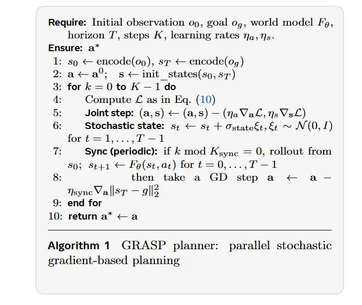

# Image Description

**File:** img_1770954326_aqad1rrrgz7ceh9_require_initial_observation_09_goal.jpg
**Original:** image.jpg
**Received:** 1770954326

## Extracted Text (OCR)

Require: Initial observation 09, goal до, world model Fg, horizon J', steps A, learning rates 7g, 7)s-

м

Елсиге а

1: so &lt; encode(og), sr &lt; encode(dg )

<!-- formula-not-decoded -->

3. for к — 0 to K — 1do

A:

Compute С as in Eq. (10)

- 5: Joint step: (а, 3) &lt; (а, 3) — (по Ма, п; VsLl)
- 6: Stochastic state: 5: + s+ + Ostateé+,&amp; ~ N (0,1) fort =—1,...,i°— 1

7:

Sync (periodic): if Е mod AKgynce = 0, rollout trom

<!-- formula-not-decoded -->

<!-- formula-not-decoded -->

10: returna’ &lt;a

Algorithm 1 GRASP planner: parallel stochastic eradient-based planning

## Usage Instructions

When referencing this image in markdown:
1. Use relative path based on file location
2. Add descriptive alt text based on OCR content above
3. Add text description BELOW the image for GitHub rendering

Example:
```markdown
 <!-- TODO: Broken image path -->

**Image shows:** [Describe what the image contains based on OCR]
```
