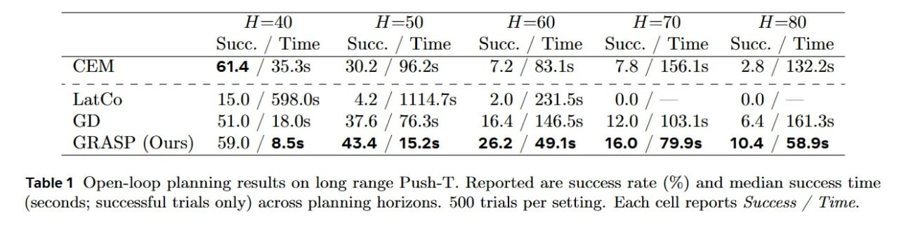

# Image Description

**File:** img_1770954326_aqad1xrrgz7ceh_50.jpg
**Original:** image.jpg
**Received:** 1770954326

## Extracted Text (OCR)

|                                                                  |                                                                          |                                                                              | Н =50  Н =600  A=—70  As)   | Н =50  Н =600  A=—70  As)                                                  | Н =50  Н =600  A=—70  As)   |
|------------------------------------------------------------------|--------------------------------------------------------------------------|------------------------------------------------------------------------------|-----------------------------|----------------------------------------------------------------------------|-----------------------------|
|                                                                  | Succ. / Time Succ. / Time Succ. / Time Succ. / Time Succ. / Time         |                                                                              |                             |                                                                            |                             |
|                                                                  | CEM  61.4 / 35.3s  30.2 / 96.2s  7.2 / 83.1s  7.8 / 156.1s  2.8 / 132.2s |                                                                              |                             |                                                                            |                             |
| LatCo  15.0 /  598.0s  4.2 / 1114.7s  2.0 / 231.58  0.0 /  0.0 / |                                                                          |                                                                              |                             |                                                                            |                             |
|                                                                  |                                                                          | GD  51.0 /  18.0s  37.6 / 76.3s  16.4 / 146.5s  12.0 / 103.1s  6.4 /  161.3s |                             |                                                                            |                             |
|                                                                  |                                                                          |                                                                              |                             | GRASP (Ours) 59.0 / 8.58 43.4 / 15.25 26.2 /49.1s 16.0 /79.9s 10.4 / 58.9s |                             |

Table 1 Open-loop planning results on long range Push-T. Reported are success rate (%) and median success time (seconds; successful trials only) across planning horizons. 500 trials per setting. Each cell reports Success / Time.

## Usage Instructions

When referencing this image in markdown:
1. Use relative path based on file location
2. Add descriptive alt text based on OCR content above
3. Add text description BELOW the image for GitHub rendering

Example:
```markdown
 <!-- TODO: Broken image path -->

**Image shows:** [Describe what the image contains based on OCR]
```
