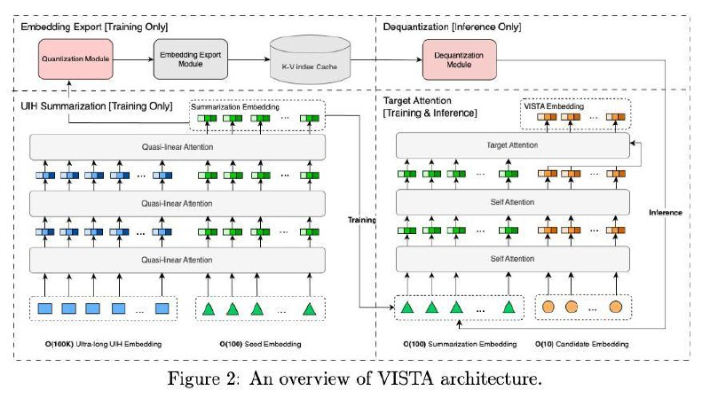

# Image Description

**File:** img_1770954490_aqadixnrg8taceh9_figure_2_an_overview_of_vista.jpg
**Original:** image.jpg
**Received:** 1770954490

## Extracted Text (OCR)

Figure 2: An overview of VISTA architecture.

<!-- image -->

## Usage Instructions

When referencing this image in markdown:
1. Use relative path based on file location
2. Add descriptive alt text based on OCR content above
3. Add text description BELOW the image for GitHub rendering

Example:
```markdown
 <!-- TODO: Broken image path -->

**Image shows:** [Describe what the image contains based on OCR]
```
