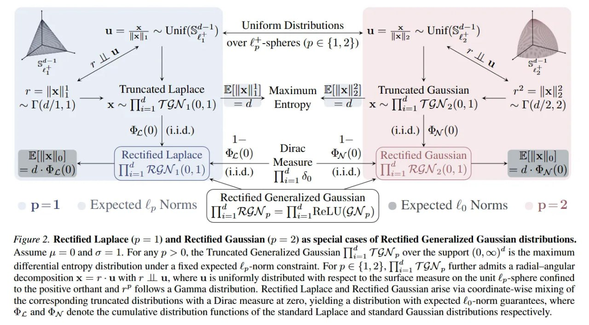

# Image Description

**File:** img_1771230020_aqadjbrrgz7eeh_figure_2_rectified_laplace_p.jpg
**Original:** image.jpg
**Received:** 1771230020

## Extracted Text (OCR)

Figure 2. Rectified Laplace (p = 1) and Rectified Gaussian (p = 2) as special cases of Rectified Generalized Gaussian distributions. Assume д = О and в = 1. For any р &gt; 0, the Truncated Generalized Gaussian ПД. TGN, over the support (0, 00)? is the maximum differential entropy distribution under a fixed expected £,-norm constraint. For p € {1,2}, i TGN,, further admits a radial—angular decomposition x = r-u withr IL u, where u is uniformly distributed with respect to the surface measure on the unit £,,-sphere confined to the positive orthant and г" follows a Gamma distribution. Rectified Laplace and Rectified Gaussian arise via coordinate-wise mixing of the corresponding truncated distributions with a Dirac measure at zero, yielding a distribution with expected /g)-norm guarantees, where Ф; and Фл denote the cumulative distribution functions of the standard Laplace and standard Gaussian distributions respectively.

<!-- image -->

## Usage Instructions

When referencing this image in markdown:
1. Use relative path based on file location
2. Add descriptive alt text based on OCR content above
3. Add text description BELOW the image for GitHub rendering

Example:
```markdown
 <!-- TODO: Broken image path -->

**Image shows:** [Describe what the image contains based on OCR]
```
