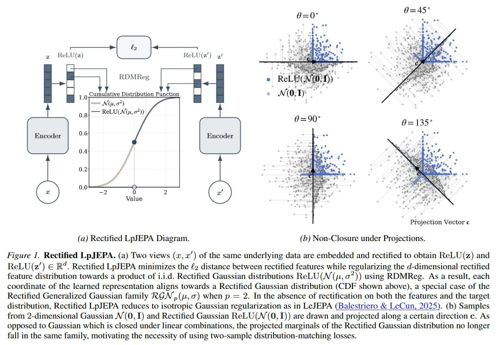

# Image Description

**File:** img_1771230020_aqadjxrrgz7eeh_figure_1_rectified_lp_jepa_a.jpg
**Original:** image.jpg
**Received:** 1771230020

## Extracted Text (OCR)

Figure 1. Rectified Lp JEPA. (a) Two views (т, x') of the same underlying data are embedded and rectified to obtain ReLU(z) and ReLU(z') € В". Rectified LpJEPA minimizes the #&gt; distance between rectified features while regularizing the d-dimensional rectified feature distribution towards a product of 1.1.4. Rectified Gaussian distributions ReLU(N (1, 0*)) using RDMReg. As a result, each coordinate of the learned representation aligns towards a Rectified Gaussian distribution (CDF shown above), a special case of the Rectified Generalized Gaussian family RGN ,,(j2,0) when р = 2. In the absence of rectification on both the features and the target distribution, Rectified LpJEPA reduces to isotropic Gaussian regularization as in Ее ЛЕРА (Balestriero &amp; LeCun, 2025). (b) Samples from 2-dimensional Gaussian Л/(О, Г) and Rectified Gaussian ReLU(V(0,1I)) are drawn and projected along a certain direction с. As opposed to Gaussian which 1$ closed under linear combinations, the projected marginals of the Rectified Gaussian distribution no longer fall in the same family, motivating the necessity of using two-sample distribution-matching losses.

<!-- image -->

## Usage Instructions

When referencing this image in markdown:
1. Use relative path based on file location
2. Add descriptive alt text based on OCR content above
3. Add text description BELOW the image for GitHub rendering

Example:
```markdown
 <!-- TODO: Broken image path -->

**Image shows:** [Describe what the image contains based on OCR]
```
