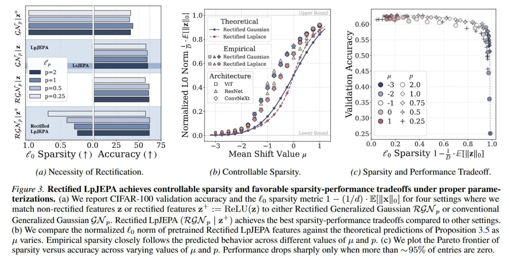

# Image Description

**File:** img_1771230020_aqadkhrrgz7eeh_fieure_5_kectihned_lpjjepa_achieves_cont.jpg
**Original:** image.jpg
**Received:** 1771230020

## Extracted Text (OCR)

Fieure 5. Kectihned LpjJEPA achieves controllable sparsity and favorable sparsity-pertormance tradeotis under proper parameterizations. (a) We report CIFAR-100 validation accuracy and the fg sparsity metric 1 — (1/d) - E|

o| for four settings where we match non-rectified features z or rectified features 2' ;= ReLU(z) to either Rectified Generalized Gaussian RGN ,, or conventional Generalized Gaussian GN. Rectified LpJEPA (RGN, | z* ) achieves the best sparsity-performance tradeoffs compared to other settings. (b) We compare the normalized fp norm of pretrained Rectified LpJEPA features against the theoretical predictions of Proposition 3.5 as и varies. Empirical sparsity closely follows the predicted behavior across different values of jz and р. (с) We plot the Pareto frontier of sparsity versus accuracy across varying values of д and р. Performance drops sharply only when more than ~ 95% of entries are zero.

<!-- image -->

## Usage Instructions

When referencing this image in markdown:
1. Use relative path based on file location
2. Add descriptive alt text based on OCR content above
3. Add text description BELOW the image for GitHub rendering

Example:
```markdown
 <!-- TODO: Broken image path -->

**Image shows:** [Describe what the image contains based on OCR]
```
