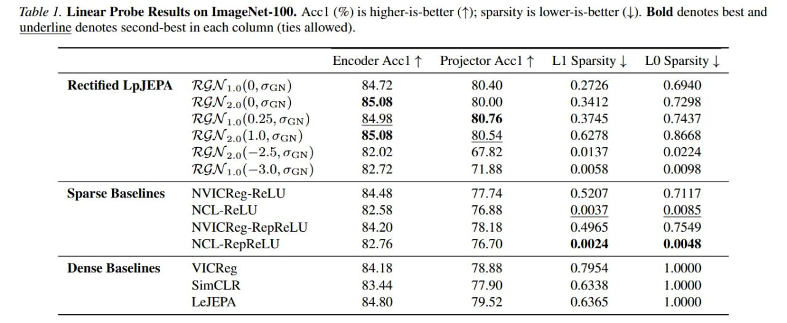

# Image Description

**File:** img_1771230020_aqadkxrrgz7eeh_lmear_probe_kesults_on.jpg
**Original:** image.jpg
**Received:** 1771230020

## Extracted Text (OCR)

таре Г. Lmear Probe Kesults on ImageNet-L00. Acc! (%) 1s higher-1s-better (7); sparsity 1$ lower-is-better (1). Bold denotes best and underline denotes second-best т each column (ties allowed).

|                                                                                                      | Encoder Асс! — Projector Acc! — LI Sparsity | LO Sparsity |   |
|------------------------------------------------------------------------------------------------------|---------------------------------------------------------------|
| Rectified LpJEPA RGN 1.0(0,7GN) 84.72 80.40 0.2726 0.6940 RGN 2.0(0,7qNn) $5.08 80.00 0.3412 ().7298 |                                                               |
| RGN ;.9(0.25, вск) 84.98 80.76 0.3745 0.7437                                                         |                                                               |
| RGN 2.9(1.0, всм) 85.08 80.54 0.6278 0.8668                                                          |                                                               |
| RGN ».o(—2.5, вам) 82.02 67.82 0.0137 0.0224                                                         |                                                               |
| RGN 1.9(—3.0, can) 82.72 71.88 0.0058 0.0098                                                         |                                                               |
| Sparse Baselines NVICReg-ReLU $4.48 77.74 {).5207 O.7117                                             |                                                               |
| NVIiCKeg-RKRepReLU 54.20 16.18 0.4965 0. 7549                                                        |                                                               |
| NCL-RepReLU 52.76 16./0 0.0024 0.0048                                                                |                                                               |
| Dense Baselines ViCReg 64.18 {8.58 {). 954 14000                                                     |                                                               |

## Usage Instructions

When referencing this image in markdown:
1. Use relative path based on file location
2. Add descriptive alt text based on OCR content above
3. Add text description BELOW the image for GitHub rendering

Example:
```markdown
 <!-- TODO: Broken image path -->

**Image shows:** [Describe what the image contains based on OCR]
```
