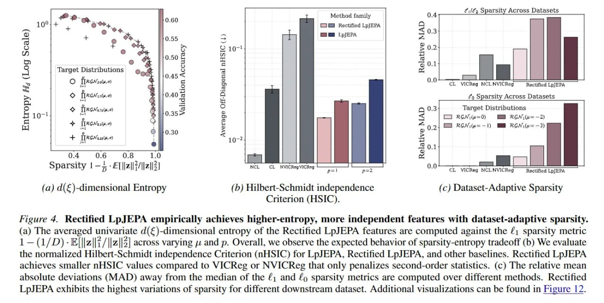

# Image Description

**File:** img_1771230020_aqadlrrrgz7eeh_fieure_4_rectihed_lpjepa_empirically_ach.jpg
**Original:** image.jpg
**Received:** 1771230020

## Extracted Text (OCR)

Fieure 4. Rectihed LpJEPA empirically achieves higher-entropy, more independent features with dataset-adaptive sparsity. (a) The averaged univariate d(€)-dimensional entropy of the Rectified LpJEPA features are computed against the #1 sparsity metric 1 —(1/D)-E||z||{/||z||5] across varying jz and р. Overall, we observe the expected behavior of sparsity-entropy tradeoff (b) We evaluate the normalized Hilbert-Schmidt independence Criterion (nHSIC) for LpJEPA, Rectified LpJEPA, and other baselines. Rectified LpJEPA achieves smaller nHSIC values compared to VICKeg ог МУ Кей that only penalizes second-order statistics. (с) [he relative mean absolute deviations (MAD) away from the median of the £; and £9 sparsity metrics are computed over different methods. Rectified LpJEPA exhibits the highest variations of sparsity for different downstream dataset. Additional visualizations can be found in Figure | 2.

<!-- image -->

## Usage Instructions

When referencing this image in markdown:
1. Use relative path based on file location
2. Add descriptive alt text based on OCR content above
3. Add text description BELOW the image for GitHub rendering

Example:
```markdown
 <!-- TODO: Broken image path -->

**Image shows:** [Describe what the image contains based on OCR]
```
